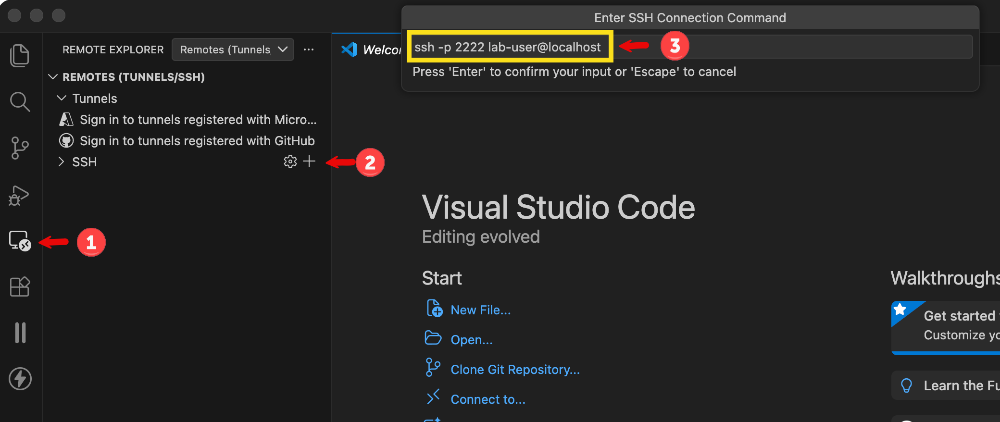
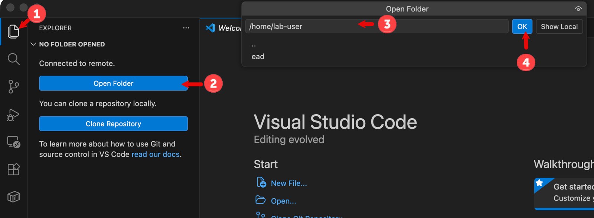
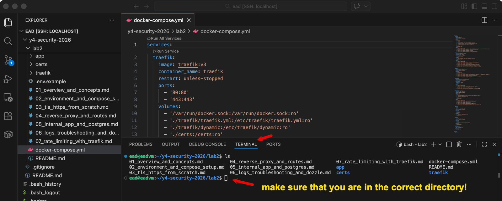

# Enterprise Security (Cloud and IoT)

### Part 2: Cloud Security

##### Lecturer:       **Enda Lee**

##### Contact/ Email: **`enda.lee@tudublin.ie`**

------

#### Lab 1
##### &#x1f4c4; [Set up a virtualized Linux server environment](./lab1/lab1.1.md)

#### Lab 2

##### &#x1f4c4; [2.1 Introduction](./lab2/01_overview_and_concepts.md)

##### &#x1f4c4; [2.2 Environment Setup](./lab2/02_environment_and_compose_setup.md)

##### &#x1f4c4; [2.3 TLS/ HTTPS](./lab2/03_tls_https_from_scratch.md)

##### &#x1f4c4; [2.4 Ingress - Reverse Proxy and Routes](./lab2/04_reverse_proxy_and_routes.md)

##### &#x1f4c4; [2.5 Internal Apps and Services](./lab2/05_internal_app_and_postgres.md)

##### &#x1f4c4; [2.6 Logging and Troubleshooting](./lab2/06_logs_troubleshooting_and_dozzle.md)

##### &#x1f4c4; [2.7 Rate Limiting with Traefik](./lab2/07_rate_limiting_with_traefik.md)

#### Lab 3

##### &#x1f4c4; [1. Introduction](./lab3/01_lab3_overview_and_architecture.md)

##### &#x1f4c4; [2. Keycloak Setup](./lab3/02_add_keycloak_and_database.md)

##### &#x1f4c4; [3. Keycloak Login and Management](./lab3/03_keycloak_first_login_realm_users_clients.md)

##### &#x1f4c4; [4. Protect a single Application](./lab3/04_protect_one_app_with_keycloak.md)

##### &#x1f4c4; [5. Single Sing On (SSO)](./lab3/05_sso_across_two_apps.md)

##### &#x1f4c4; [6. Troubleshooting](./lab3/06_troubleshooting_policies_and_exercises.md)

#### Lab 4

##### &#x1f4c4; [1. Overview and Architecture](./lab4/01_lab4_overview_and_architecture.md)

##### &#x1f4c4; [2.Prepare the Environment](./lab4/02_restore_lab2_base_and_prepare.md)

##### &#x1f4c4; [3. Traefik Access Logs and Add CrowdSec](./lab4/03_enable_traefik_access_logs_and_add_crowdsec.md)

##### &#x1f4c4; [4. Test CrowdSec Decisions, Remediation, and Blocking Workflow](./lab3/04_test_crowdsec_and_blocking.md)

##### &#x1f4c4; [5. Vulnerability Scanning with Trivy)](./lab4/05_vulnerability_scanning_with_trivy.md)

##### &#x1f4c4; [6. Web Application Testing with OWASP ZAP](./lab4/06_web_application_testing_with_zap.md)

##### &#x1f4c4; [7. Coraza WAF Add-On](./lab4/07_optional_coraza_waf_add_on.md)

##### &#x1f4c4; [8. Troubleshooting, Review, and Final Exercises](./lab4/08_troubleshooting_review_and_exercises.md)

#### Lab 5

##### &#x1f4c4;  [1. Overview and Architecture](lab5/01_lab5_overview_and_architecture.md) 

##### &#x1f4c4;  [2. Prepare the Environment](lab5/02_restore_lab4_base_and_prepare.md) 

##### &#x1f4c4;  [3. Logging with Dozzle](lab5/03_logging_with_dozzle.md) 

##### &#x1f4c4;  [4. Loki and Promtail](lab5/04_retained_logs_with_loki_and_promtail.md) 

##### &#x1f4c4;  [5. cAdvisor and Prometheus](lab5/05_metrics_with_cadvisor_and_prometheus.md) 

##### &#x1f4c4;  [6. Visualisation and Alerting with Grafana](lab5/06_visualisation_and_alerting_with_grafana.md) 

##### &#x1f4c4;  [7. Using Logs and Metrics Together](lab5/07_using_logs_and_metrics_together.md) 

##### &#x1f4c4;  [8. Hardening the Observability Stack](lab5/08_hardening_the_observability_stack.md) 

##### &#x1f4c4;  [9. Troubleshooting, Review, and Final Exercises](lab5/09_troubleshooting_review_and_exercises.md)

### Using VS Code to work with VMs and Containers

##### Read and try for this for labs: [VS Code Remote Development using SSH](https://code.visualstudio.com/docs/remote/ssh)

1. Install the **[Remote - SSH](https://marketplace.visualstudio.com/items?itemName=ms-vscode-remote.remote-ssh)** Extension in VS Code.

1. Install the **[Remote Development](https://marketplace.visualstudio.com/items?itemName=ms-vscode-remote.vscode-remote-extensionpack)** Extension in VS Code.

1. Use **remote explorer** in **VS Code** to connect to your VM.

   Use the ssh command **`ssh -p 2222 lab-user@localhost`** to connect VS Code to your VM and enter your password when prompted.

4. Once connected, use open folder to open you home directory on the VM (enter `~` or the full path, e.g. `/home/lab-user`

5. Use VS Code file explorer and terminal to work with your VM.

### Reading

**[Linux Journey](https://linuxjourney.com/)** *(Highly Recommended)*

*   **Why:** The absolute best starting point. It breaks Linux down into small, bite-sized modules. It covers permissions, processes, and text processing visually.
*   **Focus:** Complete the "Command Line" and "Text" sections for this module.

**[OverTheWire: Bandit Wargame](https://overthewire.org/wargames/bandit/)** *(Gamified)*

*   **Why:** A game where you learn Linux commands to "hack" into the next level. Level 1 requires SSH, Level 2 requires file reading, etc.
*   **Focus:** Levels 0–10 are perfect for practicing SSH, `grep`, `find`, and file permissions.

**[The Linux Command Line (Free Book)](https://linuxcommand.org/tlcl.php)**

*   **Why:** The standard textbook for Linux. The author, William Shotts, offers the PDF for free.
*   **Focus:** Chapter 6 (Redirection) and Chapter 19 (Regular Expressions/Grep).

**[Docker Curriculum](https://docker-curriculum.com/)**

*   **Why:** A comprehensive, plain-English tutorial created by a developer, not a corporation. It covers everything from "Hello World" to deploying on AWS.
*   **Focus:** Sections 1 through 4 (Basics to Docker Compose).

**[Play with Docker](https://labs.play-with-docker.com/)**

*   **Why:** An official browser-based sandbox. If your local VM breaks or you don't have enough RAM, you can spin up a Docker instance inside your web browser for free (requires Docker Hub account).
*   **Focus:** Use this to practice multi-container networking without breaking your own laptop.

##### Print these out or keep them bookmarked during Labs.

*   **[Docker CLI Cheatsheet](https://docs.docker.com/get-started/docker_cheatsheet.pdf)** (Official PDF)
*   **[Linux Command Line Cheatsheet](https://cheatography.com/davechild/cheat-sheets/linux-command-line/)** (Cheatography)
*   **[Crontab.guru](https://crontab.guru/)**: Essential for understanding Linux scheduled tasks (cron jobs).

### Useful Links & Resources

#### &#x1F517; [World's Biggest Data Breaches & Hacks](https://informationisbeautiful.net/visualizations/worlds-biggest-data-breaches-hacks/)

#### &#x1F517; https://webutils.io/

#### &#x1F517; [Traefik Examples](https://github.com/frigi83/traefik-examples)

#### &#x1F517; [Mermaid Charts for Markdown](https://mermaid.live/)

#### &#x1F517; [Kroki - Diagrams as code](https://kroki.io/)

------

Enda Lee 2026