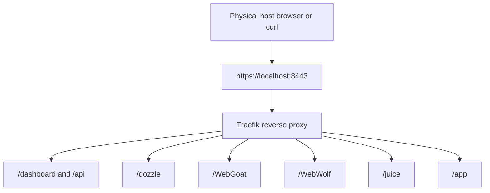
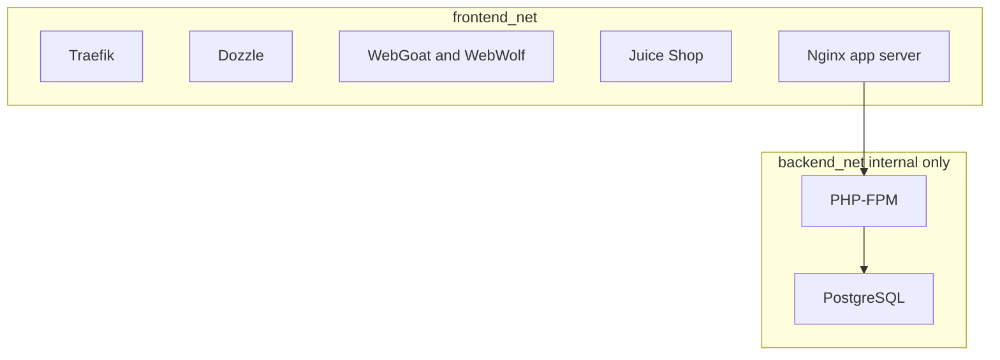
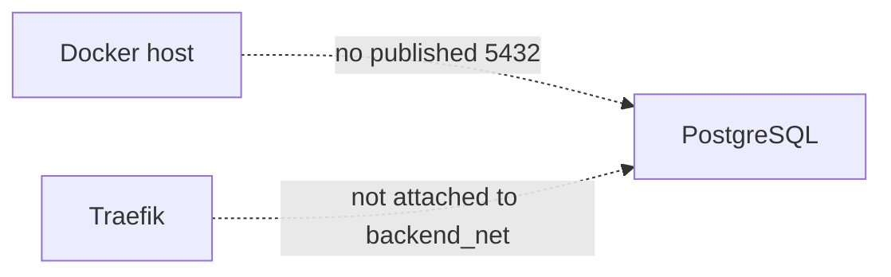

# Part 1: Overview and Core Concepts

## 1. Objectives

This lab introduces Traefik as a reverse proxy and ingress layer for several backend services.

The environment includes:

* Traefik
* Dozzle
* OWASP WebGoat and WebWolf
* OWASP Juice Shop
* an Nginx plus PHP plus PostgreSQL demonstration application

The central design goal is to show that one reverse proxy can sit in front of several services, while a database can remain internal and be reachable only through an application path.

Traefik is the reverse proxy in this lab.
Nginx is not the reverse proxy.
Nginx is only the web server for one application behind Traefik.

## 2. Why the Lab Uses `localhost` with Explicit Ports

In this teaching environment, editing the host file is not available.
That means using many hostnames such as `webgoat.local`, `juice.local`, and `app.local` is inconvenient or impossible.

Instead, this lab uses:

* `http://localhost:8080`
* `https://localhost:8443`

The services are then separated by **path prefix**:

* `https://localhost:8443/dashboard/`
* `https://localhost:8443/dozzle/`
* `https://localhost:8443/WebGoat/login`
* `https://localhost:8443/WebWolf/login`
* `https://localhost:8443/juice`
* `https://localhost:8443/app`

This lets the lab demonstrate **path-based routing** while keeping the setup simple for beginners.

## 3. Architecture Diagram: Public Ingress View

Everything public goes through Traefik first.

## 4. Architecture Diagram: Internal Application and Database Path

The demo application path is:

1. Browser -> Traefik
2. Traefik -> app-nginx
3. app-nginx -> app-php
4. app-php -> PostgreSQL

## 5. Architecture Diagram: Important Blocked Paths

This matters because secure architecture is about blocked paths as well as allowed paths.

## 6. Key Traefik Concepts

### 6.1 EntryPoints

An entrypoint is a port where Traefik listens for incoming traffic.

This lab uses:

* `web` on port 80 inside the container, published to host port 8080
* `websecure` on port 8443 inside the container, published to host port 8443

The `web` entrypoint exists mainly to redirect HTTP to HTTPS.

### 6.2 Routers

A router decides which requests match a rule.

Examples in this lab:

* requests whose path starts with `/dozzle`
* requests whose path starts with `/juice`
* requests whose path starts with `/WebGoat`
* requests whose path starts with `/WebWolf`
* requests whose path starts with `/app`

### 6.3 Services

A Traefik service is the backend application that will handle the request.

### 6.4 Middlewares

A middleware changes or controls traffic before it reaches the backend service.

This lab uses:

* `StripPrefix` for the demo application
* `RateLimit` for Dozzle

### 6.5 Static Configuration

Static configuration is needed when Traefik starts.

Examples:

* entrypoints
* providers
* dashboard/API enablement

### 6.6 Dynamic Configuration

Dynamic configuration defines runtime items such as routes, TLS material, and other rules.

In this lab:

* most routes are defined with Docker labels
* the TLS certificate is defined in a file-based dynamic config
* WebGoat and WebWolf are also defined through the file provider

## 7. Why WebGoat and WebWolf Use the File Provider Here

Most services in this lab are routed with Docker labels.

WebGoat and WebWolf are deliberately routed through a file-based dynamic config instead. This does two useful things:

* it shows that Traefik supports more than one dynamic configuration method
* it avoids container-discovery ambiguity for the WebGoat image in this lab

That means this lab now demonstrates both:

* Docker-label routing
* file-provider routing

## 8. Images Used

* `traefik:v3`
* `amir20/dozzle:latest`
* `webgoat/webgoat:latest`
* `bkimminich/juice-shop:latest`
* `nginx:latest`
* `php:8.3-fpm`
* `postgres:18-alpine`

A few comments:

* Traefik is kept on the v3 line rather than using an unbounded `latest` tag.
* Dozzle supports a configurable base path, which is useful for `/dozzle`.
* Juice Shop supports a base path setting, which is useful for reverse proxying from `/juice`.
* WebGoat serves `/WebGoat` on port `8080` and WebWolf serves `/WebWolf` on port `9090`.
* PostgreSQL 18 is used as a current major release.

## 9. Exercises

1. In your own words, explain the difference between an entrypoint, a router, a service, and a middleware.
2. Explain why `localhost` plus path-based routing is used in this lab instead of many hostnames.
3. Explain why the blocked-path diagram is important.
4. Describe the difference between Traefik and the Nginx application server in this lab.
5. Write out the full path of a request from the browser to PostgreSQL when using `https://localhost:8443/app`.
6. Explain why WebGoat and WebWolf are useful examples of file-based routing in this lab.
