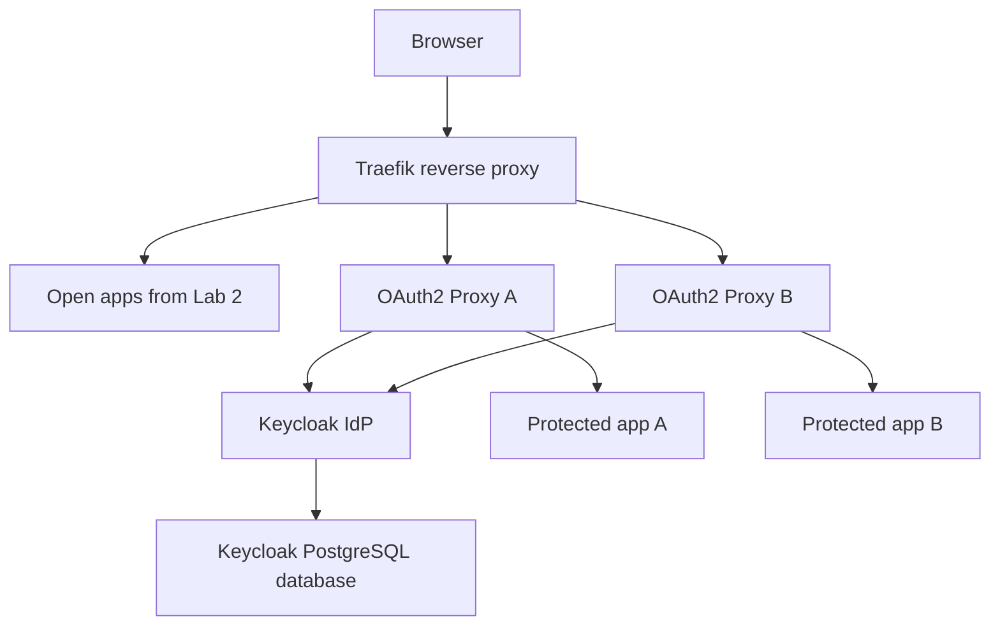
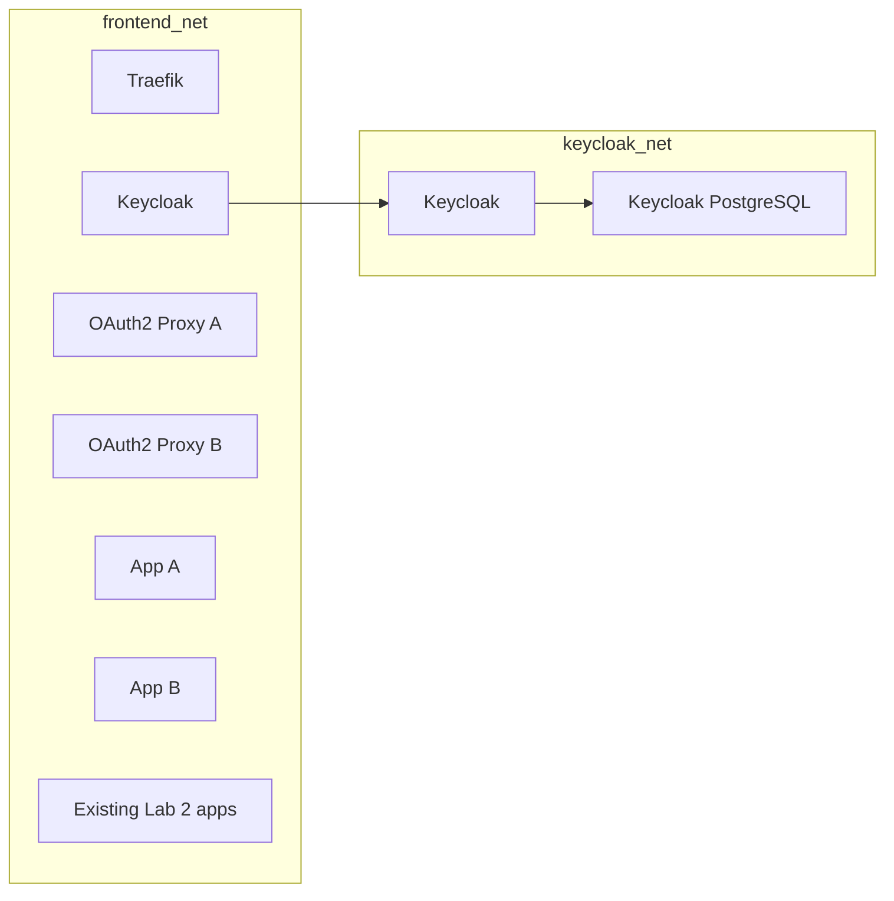

# Part 1: Lab 3 Overview and Architecture

## 1. Purpose of Lab 3

Lab 3 introduces identity and access management into the Traefik-based environment built in Lab 2.

The main question for this lab is:

**How can an existing reverse-proxy environment be extended so that access to selected applications depends on identity and login rather than only on network reachability?**

This lab uses:

* Keycloak as the identity provider
* OAuth2 Proxy as an authentication gateway in front of selected applications
* Traefik as the public ingress and routing layer

The existing applications from Lab 2 remain in place.
Lab 3 adds two protected example applications because they make the authentication and SSO flow easier to observe clearly.

## 2. How Lab 3 Relates to Lab 2

Lab 2 introduced several ideas that are reused here:

* one reverse proxy in front of many services
* explicit routes instead of broad exposure
* internal-only network paths
* troubleshooting with logs, shell access, and route tests

Lab 3 extends that model.

The architecture is no longer only about **where traffic goes**.
It also becomes about **who is allowed through**.

## 3. Main Learning Goals

By the end of this lab, the environment should demonstrate:

* what Keycloak is and where it sits in the architecture
* how to run Keycloak in a container behind Traefik
* how to create a realm, users, groups, and clients
* how to protect at least one application with Keycloak-based login
* how to show SSO across two separate applications
* how IAM changes the way reverse-proxy architecture is designed and tested

---

## 4. What Keycloak Does in This Lab

Keycloak is the identity provider.

In practical terms, it provides:

* the login page
* user management
* group and role assignment
* OpenID Connect support
* a central point of trust for more than one application

Keycloak does not replace Traefik.
Traefik still handles ingress and routing.

## 5. What OAuth2 Proxy Does in This Lab

OAuth2 Proxy is placed in front of selected applications.

It acts as a gate between Traefik and the protected application.

Its main responsibilities are:

* checking whether the browser already has an authenticated session
* redirecting to Keycloak when login is required
* receiving the callback from Keycloak after login
* creating and maintaining its own session cookie
* forwarding the request to the upstream application after authentication succeeds

This matters because many ordinary web applications do not natively implement OpenID Connect themselves.

## 6. Open Routes and Protected Routes

This lab keeps both open and protected routes in the same stack so that the difference is easy to compare.

Examples of open routes carried forward from Lab 2:

* `/dashboard/`
* `/dozzle/`
* `/juice`
* `/app`

Examples of new protected routes added in Lab 3:

* `/secure-a/`
* `/secure-b/`

Keycloak itself is published at:

* `/keycloak/`

## 7. High-Level Request Flow

For a protected application, the request path becomes:

1. browser -> Traefik
2. Traefik -> OAuth2 Proxy
3. OAuth2 Proxy -> Keycloak if login is required
4. Keycloak -> OAuth2 Proxy callback after successful login
5. OAuth2 Proxy -> protected upstream application

## 8. Diagram: Identity-Aware Ingress

## 9. Identity Model Used in This Lab

This lab uses a simple identity model that still reflects real IAM concepts:

* realm: `cloudlab`
* two example users
* one group used to control access to protected routes
* two OIDC clients, one for each OAuth2 Proxy container

This provides enough structure to demonstrate:

* user creation
* group membership
* application registration
* login flow
* SSO
* authorization decisions after authentication

## 10. Why Planning Matters in IAM Work

Identity systems become confusing quickly if names, routes, clients, and responsibilities are not planned clearly.

Before building anything, decide these things explicitly:

* Which applications should remain public?
* Which should require login?
* Which users should be able to access which applications?
* Which groups or roles will represent those rules?
* Which callback paths belong to each application?
* Which route belongs to Keycloak itself?

## 11. Security Policy Angle

This lab is not only about making login work.

It should also reinforce security-policy thinking.

A useful security policy should define:

* which applications require authentication
* which functions require stronger controls
* who can manage users and clients
* how groups and roles are assigned
* how test accounts are handled
* how audit and login events are reviewed

The technical work in this lab should be understood as implementation of those policy ideas.

## 12. New Components Added in Lab 3

Lab 3 adds these containers:

* `keycloak`
* `keycloak-db`
* `whoami-a`
* `whoami-b`
* `oauth2-proxy-a`
* `oauth2-proxy-b`

It also adds a new Traefik dynamic file for the protected routes.

## 13. Diagram: Logical Components and Networks

## 14. Why Keycloak Gets Its Own Database

The Lab 2 demo application already uses PostgreSQL.

Keycloak could be pointed at the same PostgreSQL server with a separate database name, but that would make the boundaries less clear in an introductory lab.

This lab therefore uses a separate PostgreSQL container just for Keycloak so that these responsibilities stay distinct:

* application data
* identity-platform data

## 15. What Will Be Built in Stages

The lab is split into stages:

1. add Keycloak and its database
2. run Keycloak behind Traefik
3. log into the admin console
4. create a new realm
5. add users and a group
6. create OIDC clients
7. add OAuth2 Proxy containers
8. protect one application
9. protect a second application
10. test SSO across both

## 16. Exercises

1. Explain the difference between Keycloak, OAuth2 Proxy, and Traefik in this lab.
2. Draw the request path for a browser visiting a protected application for the first time.
3. Explain why a separate Keycloak database is used.
4. Explain why planning callback paths and client IDs matters before any container is started.
