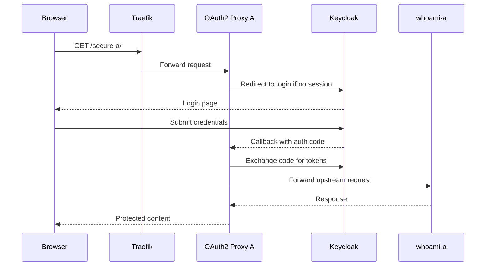

# Part 4: Protect One Application with Keycloak

## 1. Overview

This part implements access control for one application path using Keycloak and OAuth2 Proxy.

The protected path used here is:

* `https://localhost:8443/secure-a/`

The upstream application behind it is:

* `whoami-a`


## 2. File Used for the New Protected Routes

Lab 3 keeps the existing Lab 2 Traefik dynamic files:

* `traefik/dynamic/tls.yml`
* `traefik/dynamic/webgoat.yml`

The new identity-aware routes introduced in this part are placed in a separate file:

* `traefik/dynamic/lab3-keycloak-routes.yml`

This file contains the routes for:

* `/secure-a`
* `/secure-b`
* `/oauth2/a`
* `/oauth2/b`

Keeping these routes together makes the Keycloak and OAuth2 Proxy flow easier to read.


## 3. Request Flow for the First Protected Application

When a browser requests `https://localhost:8443/secure-a/`, the intended flow is:

1. Traefik matches the `/secure-a` route
2. Traefik forwards the request to `oauth2-proxy-a`
3. OAuth2 Proxy checks whether the browser already has a valid proxy session
4. If not, OAuth2 Proxy redirects the browser to Keycloak
5. The user logs in at Keycloak
6. Keycloak redirects the browser back to the OAuth2 Proxy callback endpoint
7. OAuth2 Proxy exchanges the authorization code for tokens and creates its own session cookie
8. OAuth2 Proxy forwards the request upstream to `whoami-a`


## 4. Diagram: Protected Request Flow




## 5. What OAuth2 Proxy Is Doing Here

OAuth2 Proxy is acting as a gate in front of the upstream application.

Keycloak is the identity provider.
OAuth2 Proxy is the component that uses Keycloak in order to decide whether the browser can reach the upstream app.

More concretely:

* Keycloak presents the login interface and authenticates the user
* OAuth2 Proxy starts the login flow, receives the callback, manages its own cookie, and forwards traffic to the application only after authentication succeeds


## 6. Important OAuth2 Proxy Settings Explained Clearly

The settings in `docker-compose.yml` are worth understanding carefully.

### 6.1 `--provider=keycloak-oidc`

This tells OAuth2 Proxy which identity-system behaviour it should expect.

OAuth2 Proxy supports more than one provider type.
Here it is told to speak to Keycloak as an OpenID Connect provider.

That affects things such as:

* how it discovers provider information
* which endpoints it uses
* how it expects tokens and user information to be returned

### 6.2 `--oidc-issuer-url=https://localhost:8443/keycloak/realms/cloudlab`

This tells OAuth2 Proxy where the OpenID Connect metadata for the realm is located.

The issuer URL points to the realm itself, not just to the Keycloak homepage.

From that issuer URL, OAuth2 Proxy can learn important information such as:

* the authorization endpoint
* the token endpoint
* the userinfo endpoint
* signing-key information used to validate tokens

If the issuer URL is wrong, the proxy will not know how to communicate correctly with Keycloak for that realm.

### 6.3 `--redirect-url=https://localhost:8443/oauth2/a/callback`

This is the browser callback endpoint used after successful login.

The login flow works like this:

1. OAuth2 Proxy sends the browser to Keycloak
2. the user logs in at Keycloak
3. Keycloak sends the browser back to this callback URL

That means this URL must:

* be reachable through Traefik
* point to the correct OAuth2 Proxy instance
* exactly match the redirect URI registered in the Keycloak client

### 6.4 `--http-address=0.0.0.0:4180`

This tells OAuth2 Proxy which address and port it should listen on inside its container.

Traefik forwards requests to that internal port through the route definition in `lab3-keycloak-routes.yml`.

### 6.5 `--upstream=http://whoami-a:80/`

This is the application that should receive traffic after authentication succeeds.

In other words, if the browser is authenticated and allowed, OAuth2 Proxy forwards the request to `whoami-a` on port `80`.

If this upstream value is wrong, login may succeed but the protected application will still fail to load.

### 6.6 `--cookie-secret=`

OAuth2 Proxy uses its own cookie to remember that the browser has already completed the login flow.

This secret is used to secure that cookie.

Without it, the proxy would not be able to maintain a trusted authenticated session for the browser.

### 6.7 `--client-id=` and `--client-secret=`

These identify the Keycloak client that OAuth2 Proxy is using.

They prove to Keycloak which registered relying party is making the authentication request.

That is why the client must be created in Keycloak before the proxy can be fully configured.

### 6.8 `--scope=openid profile email`

This tells OAuth2 Proxy what identity information it is requesting from Keycloak.

The scopes here mean:

* `openid`: this is an OpenID Connect login flow
* `profile`: ask for standard profile information
* `email`: ask for email information

Additional claims such as group membership are made available through Keycloak configuration rather than only through this scope line.

### 6.9 `--reverse-proxy=true`

This tells OAuth2 Proxy that it is operating behind another proxy, which in this lab is Traefik.

That matters for how it interprets forwarded headers and builds redirect behaviour correctly.

### 6.10 `--whitelist-domain=localhost`

This restricts redirect handling to the expected domain used in the lab.

Because this lab uses `localhost` with path-based routing, that is the appropriate domain to allow.


## 7. Browser Test for the Protected Route

Open in a browser:

```text
https://localhost:8443/secure-a/
```

Expected behaviour:

* the browser is redirected to Keycloak login
* after successful login, the browser is returned to the protected route
* `whoami-a` content becomes visible

This browser-based test is important because it lets you observe the redirects, cookies, and callback behaviour directly in the browser developer tools.


## 8. Command-Line Test for the Protected Route

A browser is the best way to observe the full login experience, but `curl` is still useful for checking how the route behaves before login completes.

```bash
curl -k -I https://localhost:8443/secure-a/
```

Expected result:

* an HTTP redirect rather than direct application content

That shows the request is reaching the authentication gate rather than the upstream application immediately.


## 9. Add Group-Based Authorization

To make the access-control example stronger, configure `oauth2-proxy-a` so that only members of `lab3-users` are allowed.

Add this argument to the `oauth2-proxy-a` command list:

```yaml
      - --allowed-group=/lab3-users
```

If group claims are configured correctly, this means:

* `alice` can log in and reach the application
* `bob` can authenticate but should be denied access if not in the group


## 10. Authentication vs Authorization at This Stage

This is the first point in the lab where it is useful to distinguish two separate questions:

* **Authentication**: did the user successfully prove identity to Keycloak?
* **Authorization**: after that, should the protected route still allow access?

A user can succeed at the first and still fail the second.


## 11. Troubleshooting This Stage

If login fails or loops, check these items in order:

1. Is Keycloak reachable at `/keycloak/`?
2. Does the OIDC client redirect URI match exactly?
3. Was the client secret copied correctly into Compose?
4. Is the issuer URL using the correct realm path?
5. Are the OAuth2 Proxy containers up and healthy?
6. Are cookies being set over HTTPS correctly?
7. If group restriction is enabled, are group claims actually present?


## 12. Useful Logs

```bash
docker compose logs keycloak --tail=100
docker compose logs oauth2-proxy-a --tail=100
docker compose logs traefik --tail=100
docker compose logs whoami-a --tail=50
```


## 13. Exercises

1. Visit `/secure-a/` and describe every visible redirect step in the browser.
2. Use browser developer tools to identify the callback path used after login.
3. Explain which component is responsible for authenticating the user and which component forwards the final request to the application.
4. Add the group restriction and compare access as `alice` and `bob`.
