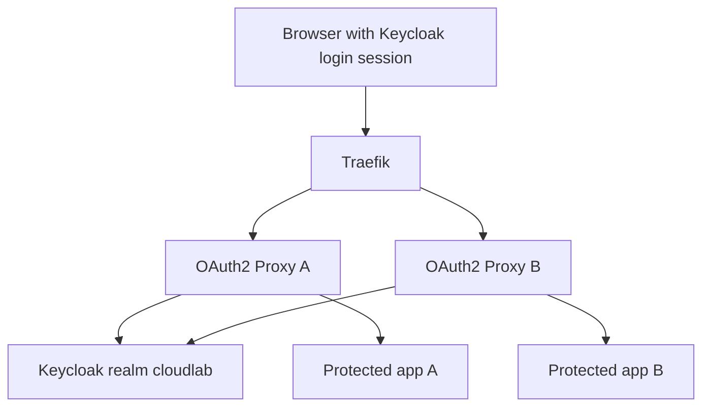

# Part 5: SSO Across Two Separate Applications

## 1. Overview

This part extends the same pattern to a second protected application.

The second protected path is:

* `https://localhost:8443/secure-b/`

The upstream application behind it is:

* `whoami-b`

The aim is to show SSO clearly across two separate applications in the same browser session.


## 2. What SSO Means Here

Single sign-on does not mean that two applications share one internal application session.

In this lab, SSO means:

* both protected applications trust the same Keycloak realm
* both OAuth2 Proxy containers use Keycloak as the same identity provider
* once the browser already has a valid Keycloak login session, the second protected route can usually be reached without another full credential prompt


## 3. Why Two OAuth2 Proxy Instances Are Used

The lab uses:

* `oauth2-proxy-a` for `whoami-a`
* `oauth2-proxy-b` for `whoami-b`

This makes the separation visible.

Each protected application has:

* its own route
* its own client
* its own OAuth2 Proxy container

That helps make the trust relationships easier to trace and test.


## 4. Diagram: SSO Across Two Applications




## 5. Start the Second Protected Path

If `oauth2-proxy-b` and `whoami-b` are not already running, start them:

```bash
docker compose up -d whoami-b oauth2-proxy-b
```

Confirm they are running:

```bash
docker compose ps
docker compose logs oauth2-proxy-b --tail=50
```


## 6. Browser-Based SSO Test

Use the same browser session throughout this test.

1. Open `https://localhost:8443/secure-a/`
2. Log in through Keycloak as `alice`
3. Confirm the first protected application is visible
4. Without logging out, open `https://localhost:8443/secure-b/` in the same browser session

Expected result:

* the second application should not require a full new credential entry if the Keycloak login session is still valid
* the browser may still be redirected briefly through the identity flow, but Keycloak should already know the user session


## 7. Observing SSO in Browser Developer Tools

This is a good place to use the browser developer tools.

Things to watch:

* the initial redirect from `/secure-a/` to Keycloak
* the callback request after login
* the later request to `/secure-b/`
* whether the second visit uses the existing Keycloak session instead of prompting for credentials again
* cookies set by the browser for the auth flow

This is one reason browser-based testing is important in addition to `curl`.


## 8. Why the Second Application Still Has Its Own Client

Even though SSO is working, each protected application still has its own OIDC client.

That is useful because each application can have:

* its own redirect URI
* its own client secret
* its own claims and mapper decisions
* its own access rules

SSO reduces repeated login effort, but it does not remove the identity of each separate relying party.


## 9. Add the Same Group Restriction to the Second Application

To keep the authorization model consistent, add the same group rule to `oauth2-proxy-b`:

```yaml
      - --allowed-group=/lab3-users
```

Then recreate it:

```bash
docker compose up -d --force-recreate oauth2-proxy-b
```

Now both protected applications require:

* successful authentication through Keycloak
* membership in `lab3-users`


## 10. What SSO Does Not Solve Automatically

SSO improves the login experience and centralises trust, but it does not by itself provide:

* correct authorization design
* least privilege
* good session-lifetime policy
* good audit review
* correct group or role assignment


## 11. Command-Line Tests

A browser is still the best way to observe SSO itself, but command-line checks are useful for route behaviour:

```bash
curl -k -I https://localhost:8443/secure-a/
curl -k -I https://localhost:8443/secure-b/
```

These checks help show that both routes are fronted by authentication rather than exposing the upstream apps directly.


## 12. Suggested Browser Test Matrix

| Test | Expected result |
|---|---|
| Open `/secure-a/` with no prior login | Redirect to Keycloak login |
| Log in as allowed user | Access granted to app A |
| Open `/secure-b/` in same browser session | Access granted with SSO behaviour |
| Try a user outside the allowed group | Authentication may succeed, but application access should be denied |


## 13. Exercises

1. Demonstrate SSO by logging into `secure-a` and then visiting `secure-b` in the same browser session.
2. Use the browser developer tools to compare the first and second protected visits.
3. Explain why the two applications do not need to share one internal session store for SSO to work.
4. Explain why each protected application still needs its own registered client.
