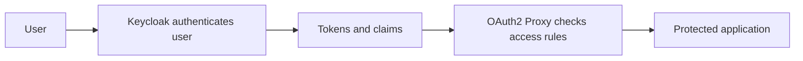

# Part 6: Troubleshooting, Keycloak Features, Policies, and Final Exercises

## 1. Overview

This part consolidates the IAM ideas from the lab and adds a structured troubleshooting and review section.


## 2. Keycloak Features Worth Reviewing

At this point, revisit these Keycloak areas and explain what each is for:

* Users
* Groups
* Roles
* Clients
* Client scopes
* Sessions
* Realm settings
* Events


## 3. Access Policy Model Used in This Lab

The lab policy model is intentionally simple:

* only members of `lab3-users` should be allowed to reach the protected demo applications
* identity should come from the `cloudlab` realm
* authentication is centralised in Keycloak
* protected applications should not implement separate local login for this lab

This is still a real policy model even though the environment is small.


## 4. Why Policies Matter

Without a policy model, the same environment can easily drift into inconsistency.

Typical outcomes include:

* some apps protected and others exposed accidentally
* users added directly to apps rather than through a consistent identity model
* groups and roles with no naming convention
* clients created without clear ownership
* no clear review path for access changes


## 5. Where Authorization Decisions Happen

There are two important layers here.

### Layer 1: Keycloak identity and token issuance

Keycloak is responsible for:

* authenticating the user
* issuing tokens and claims
* providing group information

### Layer 2: OAuth2 Proxy access gate

OAuth2 Proxy is responsible for:

* checking whether the authenticated identity should be allowed through
* using client configuration and group restrictions to decide whether access proceeds


## 6. Diagram: Responsibility Split




## 7. Troubleshooting Order

A good troubleshooting order is:

1. confirm containers are running
2. confirm Keycloak is reachable at `/keycloak/`
3. confirm the realm name is correct in the issuer URL
4. confirm the client redirect URI matches exactly
5. confirm the client secret was copied correctly
6. confirm the protected route reaches the correct OAuth2 Proxy container
7. confirm the OAuth2 Proxy upstream reaches the right application
8. confirm group-based restriction settings if access is denied after login


## 8. Useful Commands

```bash
docker compose ps
docker compose logs keycloak --tail=100
docker compose logs keycloak-db --tail=50
docker compose logs oauth2-proxy-a --tail=100
docker compose logs oauth2-proxy-b --tail=100
docker compose logs traefik --tail=100
docker compose logs whoami-a --tail=50
docker compose logs whoami-b --tail=50
```


## 9. Useful Route Tests

```bash
curl -I http://localhost:8080/app
curl -k -I https://localhost:8443/keycloak/
curl -k -I https://localhost:8443/secure-a/
curl -k -I https://localhost:8443/secure-b/
curl -k https://localhost:8443/dashboard/ | head
curl -k https://localhost:8443/dozzle/ | head
```

A browser is still the most useful test tool for the full login and SSO experience, especially when observing redirects, callback paths, and cookies in developer tools.


## 10. Internal Container Checks

If deeper debugging is needed:

```bash
docker compose exec keycloak sh
docker compose exec oauth2-proxy-a sh
docker compose exec oauth2-proxy-b sh
docker compose exec whoami-a sh
docker compose exec whoami-b sh
```

Useful checks include:

```bash
printenv | sort
getent hosts keycloak
getent hosts whoami-a
getent hosts whoami-b
```


## 11. Common Problems

### 11.1 Keycloak login page not reachable

Check:

* Keycloak container logs
* Traefik route to `/keycloak/`
* `KC_HTTP_RELATIVE_PATH` and hostname-related settings

### 11.2 Redirect loop after login

Check:

* redirect URI mismatch
* wrong issuer URL
* cookie problems
* wrong client secret

### 11.3 Login succeeds but protected app still not accessible

Check:

* group restriction settings
* group claim mappers
* whether the user is actually in the allowed group

### 11.4 Protected route reaches proxy but not upstream app

Check:

* upstream target in OAuth2 Proxy
* Traefik route mapping
* network membership


## 12. Relating the Lab to IAM Theory

This lab gives practical examples of ideas often introduced in IAM lectures:

* identity provider
* relying party
* authentication
* authorization
* SSO
* groups and roles
* client registration
* token-based trust


## 13. Why the Lab Is Built in Stages

IAM systems become hard to troubleshoot when too many moving parts are introduced at once.

That is why this lab is staged:

* Keycloak first
* realm and users next
* clients next
* one protected application next
* SSO extension after that

This is also a general lesson in security engineering: complex trust systems are easier to understand and verify when built incrementally.


## 14. Final Practical Exercises

### Exercise 1: Draw the full request path

Draw the full request path for:

* a first visit to `/secure-a/` with no existing session
* a later visit to `/secure-b/` after SSO is already established

### Exercise 2: Authentication vs authorization

Using the example users, explain the difference between:

* successful authentication
* successful authorization

### Exercise 3: Group-based control

Add and remove a user from `lab3-users` and explain what changes.

### Exercise 4: Client design

Explain why `whoami-a` and `whoami-b` use different OIDC clients even though the same Keycloak realm is used for both.

### Exercise 5: Route inventory

List which routes in the environment are open and which are protected.

### Exercise 6: Failure analysis

Break one of the OAuth2 Proxy client secrets on purpose and identify the resulting symptom and relevant logs.


## 15. Stretch Exercises

1. Add a third protected demo application using the same pattern.
2. Replace group-based restriction with a role-based approach.
3. Explore Keycloak event logging and identify login events for a successful session.
4. Consider how the same protection model could be applied to one of the existing Lab 2 applications later.


## 16. Summary

Lab 3 adds identity-aware access control to the multi-service Traefik environment built in Lab 2.

The most important outcomes are:

* Keycloak is introduced as a working identity platform
* access control is no longer only about network exposure and routes
* one protected application shows the basic OIDC flow clearly
* two protected applications show how SSO works across separate services
* groups and clients make authorization and trust relationships visible

The main design lesson is that IAM should be planned and layered carefully rather than bolted on at the end.
