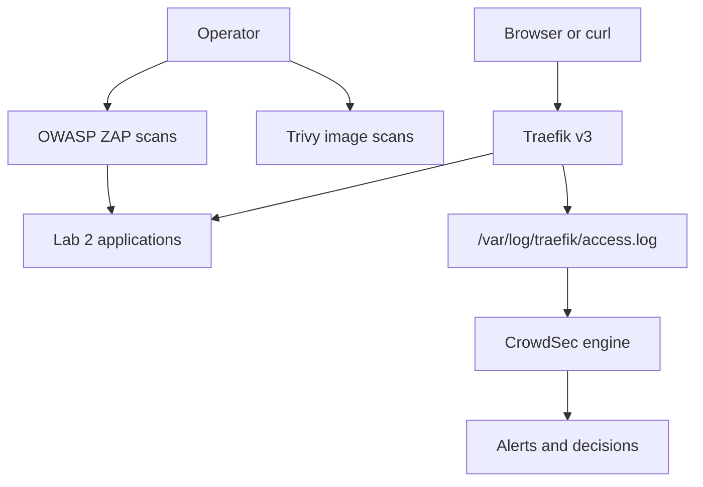

# Part 1: Lab 4 Overview and Architecture

## 1. Purpose of Lab 4

Lab 4 extends the final Lab 2 environment from routing and application exposure into active defense and security testing.

The main questions in this lab are:

* How can traffic to the existing applications be observed and acted on automatically?
* How can container images be reviewed for known vulnerabilities before or during deployment?
* How can deliberately vulnerable applications be tested safely in a controlled lab environment?
* How can a web application firewall help reduce exposure to some attack patterns?

This lab uses the existing Lab 2 stack as the base so that the new defensive controls can be understood in the context of services that are already familiar.

## 2. What This Lab Adds

Lab 4 adds the following capabilities to the Lab 2 environment:

* **CrowdSec** to analyse Traefik access logs and make decisions
* **Trivy** to scan container images for vulnerabilities and related issues
* **OWASP ZAP** to test vulnerable web applications from a browser-testing perspective
* **Optional Coraza WAF** to demonstrate in-line request inspection and blocking

These capabilities are related, but they do different jobs.

## 3. How This Differs from Earlier Labs

Lab 2 focused on:

* reverse proxying
* TLS
* path-based routing
* network separation

Lab 4 keeps that base and adds:

* detection
* prevention
* vulnerability visibility
* controlled security testing

That means the environment is no longer only deciding where traffic should go.
It is also beginning to decide whether traffic looks suspicious, whether software images have known issues, and how applications behave under security testing.

## 4. Main Learning Goals

By the end of this lab, the environment should demonstrate:

* how to restore and verify the Lab 2 base stack
* how to enable file-based Traefik access logs
* how CrowdSec can read those logs and record decisions
* how to inspect, add, and remove CrowdSec decisions
* how to scan container images with Trivy and interpret the output
* how to use OWASP ZAP against the vulnerable lab applications
* how a WAF can be added as an optional extra control for one route

## 5. Keep the Scope Safe and Controlled

This lab must stay inside the systems that belong to the lab environment.

Only use ZAP against the applications provided by the lab, such as:

* Juice Shop
* WebGoat
* the simple demo application if desired

Do not point these tools at systems that are outside the lab environment.

## 6. High-Level Architecture

The main runtime path still begins at Traefik.

Traefik now also writes access logs to a shared location.
CrowdSec reads those logs and records decisions about suspicious behaviour.

Trivy and ZAP are not in the normal request path.
They are operator-run tools used to inspect images and test applications.

## 7. Diagram: Lab 4 High-Level Architecture

## 8. Runtime Controls vs Assessment Tools

It is useful to separate the tools in this lab into two categories.

### Runtime controls

* Traefik
* CrowdSec
* optional WAF

These are involved while the environment is serving traffic.

### Assessment tools

* Trivy
* ZAP

These are used to inspect and test the environment rather than sit permanently in the main traffic path.

## 9. Why Logs Matter in This Lab

Logs are important here for two reasons.

First, CrowdSec depends on access logs to understand what requests are happening.

Second, the logs created in this lab will become useful again later when logging, monitoring, and observability are covered in more detail.

So this lab starts building practical habits for later work:

* enabling useful logs
* storing them somewhere accessible
* reading them during troubleshooting
* using them to drive decisions

## 10. Why Vulnerable Applications Are Useful Here

Juice Shop and WebGoat are already present in the Lab 2 environment.

That means the lab already has realistic targets for controlled security testing.

This is useful because the testing and defensive controls can be observed against applications that are expected to produce interesting findings.

## 11. Optional Coraza WAF Add-On

The WAF section in this lab is treated as an add-on rather than as a core dependency of the whole lab.

That keeps the main lab focused on CrowdSec, Trivy, and ZAP, while still allowing a useful comparison of request behaviour with WAF off and on.

For the add-on, the most reliable Traefik-native Coraza option is the native Coraza WAF in Traefik Hub API Gateway.
The open-source Traefik Coraza plugin exists, but it is more experimental and is therefore less suitable as the main teaching path for this lab.

## 12. Suggested Lab Sequence

The lab is organised into these stages:

1. restore the Lab 2 base
2. enable file-based Traefik access logs
3. add CrowdSec
4. test CrowdSec decisions and blocking workflow
5. scan images with Trivy
6. test vulnerable web apps with ZAP
7. optionally add Coraza WAF and compare behaviour

## 13. Exercises

1. Explain the difference between runtime security controls and operator-run assessment tools.
2. Draw the main traffic path for a request to one of the existing Lab 2 applications.
3. Explain why this lab builds on Lab 2 rather than Lab 3.
4. Explain why logs are central to the way CrowdSec works in this lab.

## 14. Documentation and Further Reading

* CrowdSec documentation: https://docs.crowdsec.net/
* Trivy documentation: https://trivy.dev/docs/latest/
* ZAP documentation: https://www.zaproxy.org/docs/
* Traefik access log documentation: https://doc.traefik.io/traefik/observability/access-logs/
