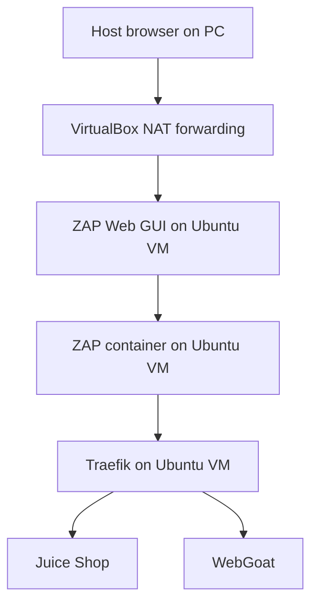

# Part 6: Web Application Testing with OWASP ZAP

## 1. Overview

This part introduces OWASP ZAP as a controlled web application security testing tool.

The focus here is on the vulnerable applications already present in the lab environment, especially:

* Juice Shop
* WebGoat

This part uses a browser-accessible ZAP GUI running in a Docker container on the Ubuntu VM.
No desktop installation is required on the host system and no desktop environment is required inside the VM.

The workflow in this part is:

1. start the ZAP container on the Ubuntu VM
2. expose the ZAP Web GUI through VirtualBox NAT port forwarding
3. access the ZAP GUI from the host browser at `http://localhost:<forwarded-port>/zap`
4. browse the lab applications through ZAP
5. inspect the Sites tree, History, and Alerts
6. use the Spider from the GUI
7. then use command-line baseline scans
8. then review more aggressive scan options as a controlled extension

## 2. Where ZAP Runs in This Lab

ZAP is not installed directly on the host PC.
ZAP is not installed as a desktop application inside the Ubuntu VM.

Instead, ZAP runs in a Docker container on the Ubuntu VM.

The GUI is then made available in the host browser using the ZAP Webswing interface.

So the roles are:

* **Ubuntu VM**: runs Docker and the ZAP container
* **VirtualBox NAT port forwarding**: exposes the ZAP GUI port from the VM to the host
* **Host browser**: opens the ZAP GUI at `localhost` on the forwarded host port
* **Lab applications**: still run behind Traefik in the VM and are reached from the host exactly as in earlier labs

This keeps the setup consistent with the rest of the labs, which already use Docker on the VM as the main execution environment and use `localhost` plus forwarded ports from the host side.

## 3. High-Level ZAP Access Model

The intended access path is:

1. ZAP runs in a container on the Ubuntu VM
2. the Webswing GUI port is published from the container to the VM
3. VirtualBox NAT forwarding maps that VM port to a host port
4. the host browser opens the forwarded GUI URL on `localhost`
5. ZAP is then used to test applications already exposed through Traefik on `https://localhost:8443/...`

## 4. Diagram: ZAP in This Lab



## 5. Why This Approach Is Used

This approach avoids two common problems:

* needing to install a local ZAP desktop application on each host PC
* needing a graphical desktop environment inside the Ubuntu VM

It also keeps all lab infrastructure in the same place: the Ubuntu VM and its Docker environment.

## 6. Prepare a Report Directory

If not already created earlier in the lab, create a directory for ZAP reports:

```bash
mkdir -p reports/zap
```

This directory will be mounted into the ZAP container so reports can be saved on the VM filesystem.

## 7. Choose the Ports to Use

The earlier labs already use host port `8443` for Traefik HTTPS and host port `8080` for Traefik HTTP.

To avoid conflicts, this part uses these ports inside the Ubuntu VM:

* `8095` on the VM for the ZAP Web GUI
* `8090` on the VM for the ZAP API

Then VirtualBox NAT forwarding should expose those same guest ports to matching host ports.

Suggested VirtualBox NAT port forwards:

* host `8095` -> guest `8095`
* host `8090` -> guest `8090`

That means the host browser will later open:

```text
http://localhost:8095/zap
```

## 8. Start the ZAP Web GUI Container

Run this command on the Ubuntu VM:

```bash
docker run -d \
  --name zap-web \
  -p 8095:8080 \
  -p 8090:8090 \
  -v "$PWD/reports/zap:/zap/wrk" \
  ghcr.io/zaproxy/zaproxy:stable zap-webswing.sh
```

What this command does:

* `--name zap-web` gives the container a predictable name
* `-p 8095:8080` publishes the ZAP Webswing GUI to VM port `8095`
* `-p 8090:8090` publishes the ZAP API port
* `-v "$PWD/reports/zap:/zap/wrk"` mounts the local report directory into the container
* `zap-webswing.sh` starts the ZAP browser-based GUI

Port `8095` is used here instead of `8080` because Lab 2 already uses host and guest port `8080` for Traefik HTTP.

## 9. Confirm That the Container Is Running

Run these commands on the Ubuntu VM:

```bash
docker ps
docker logs zap-web --tail=100
```

The logs should show that Webswing and ZAP are starting.

## 10. Confirm the Guest-Side Ports Are Listening

Still inside the Ubuntu VM, check that the published ports are listening:

```bash
ss -ltnp | grep 8095 || true
ss -ltnp | grep 8090 || true
```

This checks the VM side only.
The next step is what makes the GUI reachable from the host browser.

## 11. Configure VirtualBox NAT Port Forwarding

In the VirtualBox settings for the Ubuntu VM, open the NAT network or adapter port forwarding settings and add at least:

* host port `8095` -> guest port `8095`

Optionally also add:

* host port `8090` -> guest port `8090`

The GUI requires the forwarded `8095` path.
The API port is useful later if automation is needed, but it is not essential for the first GUI workflow.

## 12. Access the ZAP GUI from the Host Browser

From the host system, open this URL in a browser:

```text
http://localhost:8095/zap
```

If everything is working, the browser should show the ZAP interface.

This is the main GUI path used in this lab.

## 13. If the GUI Does Not Load

Check these things in order:

* is the `zap-web` container running inside the VM?
* are the guest-side ports listening?
* is the VirtualBox NAT forwarding rule present and correct?
* is the host browser using `http://localhost:8095/zap`?
* is another local service already using host port `8095`?

Useful checks on the VM:

```bash
docker ps
docker logs zap-web --tail=100
ss -ltnp | grep 8095 || true
```

Useful check on the host system:

* confirm that the earlier labs are already reachable through `localhost` and their forwarded ports
* confirm that `localhost:8095` is the port you actually forwarded in VirtualBox

## 14. The Most Important Panels in the ZAP GUI

When the GUI first opens, the most useful panels to focus on are:

* **Quick Start**
* **Sites**
* **History**
* **Alerts**

These provide the main beginner workflow:

* choose or browse a target
* see discovered URLs appear in the Sites tree
* inspect individual requests and responses in History
* inspect findings in Alerts

## 15. The Target URLs Used in This Lab

Because the host already reaches the lab applications through VirtualBox NAT forwarding, the target URLs used in ZAP should match the same host-facing addresses used in earlier labs.

Examples:

* Juice Shop: `https://localhost:8443/juice`
* WebGoat: `https://localhost:8443/WebGoat/`

That means from the host point of view:

* the ZAP GUI is at `http://localhost:8095/zap`
* the lab applications are at `https://localhost:8443/...`

## 16. First GUI Target

A good first target is Juice Shop through Traefik.

Use this target URL inside ZAP:

```text
https://localhost:8443/juice
```

Because the lab uses a self-signed certificate, the browser and ZAP may present certificate warnings.
Accept the lab certificate where required so that HTTPS traffic can still be inspected.

## 17. First Manual Browsing Workflow

A useful first workflow is:

1. open the ZAP GUI in the host browser
2. use the Quick Start tab to open the target URL or browse manually through the ZAP-controlled browser path
3. browse to Juice Shop through `https://localhost:8443/juice`
4. click around the application
5. watch the Sites tree populate
6. inspect the requests appearing in the History tab
7. inspect any passive findings in the Alerts tab

This first step is about understanding the relationship between browsing activity and what ZAP records.

## 18. What the Sites Tree Shows

The Sites tree is ZAP's structured view of the target application.

It groups discovered content under the target host and path structure.

This is useful because it shows:

* which parts of the application ZAP knows about
* which paths have been visited or discovered
* where later scans can be focused

## 19. What the History Tab Shows

The History tab records the requests and responses that ZAP has seen.

This is useful because it lets you inspect:

* request URLs
* methods such as GET and POST
* response codes
* headers
* bodies

This is one of the best places to correlate application behaviour with what the browser is doing.

## 20. What the Alerts Tab Shows

The Alerts tab shows findings raised by ZAP.

Examples of things that might appear include:

* missing security headers
* cookie flag issues
* information disclosure
* suspicious application behaviour detected by passive or active rules

Each alert should be reviewed in detail rather than treated as a simple pass/fail result.

## 21. Passive vs Active Scanning

This distinction is very important.

### Passive scanning

Passive scanning looks at requests and responses that ZAP has already seen.

It does not actively attack the target.

Useful for:

* headers
* cookie flags
* information disclosure
* mixed content and similar findings

### Active scanning

Active scanning sends attack requests to the target in order to test for weaknesses.

Useful for:

* injection-style tests
* reflected issues
* input handling weaknesses
* other vulnerability classes that require probe traffic

Active scanning should only be used against applications that belong to this lab.

## 22. Spidering a Site from the GUI

Spidering means automatically discovering pages and resources.

In ZAP, the Spider tool follows links from the starting target and builds out the known site structure.

This is useful because later testing works better when ZAP already knows the site structure.

A practical GUI workflow is:

1. browse to the target or make sure it appears in the Sites tree
2. right-click the target in the Sites tree
3. choose **Spider**
4. start the spider with the default settings first
5. review the discovered URLs when the spider finishes

## 23. Choosing a Scan Type

Different scan types are useful for different goals.

A simple set of decision rules is:

* use **manual browsing in the GUI** when the goal is to understand the application and watch live requests
* use the **Spider** when the goal is to discover more of the site structure
* use a **baseline scan** when the goal is quick passive assessment and report generation
* use a **full scan** when active probing is intended and the target and scope are already understood
* use **focused route testing** when looking at one part of Juice Shop or WebGoat rather than scanning the whole site at once

## 24. Looking for a Particular Issue Type

When the goal is to focus on a particular issue type, the general workflow is:

1. make sure the relevant part of the site has been discovered by browsing or spidering
2. choose an active scan policy that includes the relevant rules
3. narrow the scan scope to the specific route or form when appropriate
4. review the alert details in ZAP rather than only the summary count

For example, if the goal is to look more closely at an injection-style issue in a vulnerable route, it is better to focus on that route and review the specific alerts than to treat the whole site as one undifferentiated target.

## 25. Browser Developer Tools Alongside ZAP

Use browser developer tools at the same time as ZAP.

Things to compare:

* what the browser network tab shows
* what ZAP records
* what appears in the Traefik access log

This gives three views of the same traffic:

* client-side browser view
* security-testing proxy view
* reverse-proxy log view

## 26. Command-Line Baseline Scan Against Juice Shop

After the GUI workflow is clear, run a baseline scan against Juice Shop through Traefik.

Run this on the Ubuntu VM:

```bash
docker run --rm -t \
  -v "$PWD/reports/zap:/zap/wrk" \
  ghcr.io/zaproxy/zaproxy:stable zap-baseline.py \
  -t https://host.docker.internal:8443/juice \
  -r juice-baseline-report.html \
  -I
```

If `host.docker.internal` does not work in the VM environment, use the host-reachable address that works from inside the container instead.
In some VirtualBox/NAT setups, that may require experimentation with the Docker networking path.

An alternative is to run the baseline scan directly against the forwarded host-side target if that path is reachable from the container environment in your setup.

## 27. Simpler Alternative: Use the Existing ZAP Web Container Interactively and Save Reports from the GUI

If the command-line networking path becomes distracting, it is acceptable to rely on the GUI first and save reports directly from the GUI workflow.

That keeps the focus on the application assessment rather than on container-to-host routing details.

## 28. What the Baseline Scan Is Doing

The baseline scan:

* runs a short spider
* performs passive analysis on the responses it sees
* produces a report without performing a full active attack phase

This makes it a good first automation step.

## 29. Repeat the Baseline Scan Against WebGoat

If the command-line baseline path works in the environment, repeat it for WebGoat.

Example:

```bash
docker run --rm -t \
  -v "$PWD/reports/zap:/zap/wrk" \
  ghcr.io/zaproxy/zaproxy:stable zap-baseline.py \
  -t https://host.docker.internal:8443/WebGoat/ \
  -r webgoat-baseline-report.html \
  -I
```

## 30. Full Scan as a Controlled Extension

After the GUI workflow and baseline scan are understood, a more aggressive scan can be discussed.

A full scan combines:

* spidering
* optional AJAX spidering
* active scanning

This produces more load and more intrusive test traffic than the baseline scan.

That is why it should be introduced after the GUI workflow and baseline scan are already understood.

## 31. View Reports and Interpret Results

A report is more useful when it is reviewed carefully rather than treated as a pass/fail result.

Things to review in each alert:

* alert name
* risk or severity level
* confidence
* affected URL
* request and response evidence
* explanation and possible remediation

The important question is not only 'how many alerts were found?' but also 'which alerts matter most for this target and why?'

## 32. Example Scan Choices

Some simple decision rules are useful here:

* Use the **GUI plus manual browsing** when first learning how requests, alerts, and site discovery fit together.
* Use the **Spider** when the site structure is still not fully known.
* Use the **Baseline scan** when the goal is quick passive assessment and report generation.
* Use the **Full scan** only after the target and scope are understood and only against the lab’s own vulnerable applications.

## 33. Exercises

1. Start the ZAP Webswing container on the Ubuntu VM.
2. Configure VirtualBox NAT forwarding so the host browser can open `http://localhost:8095/zap`.
3. Use the GUI to browse Juice Shop and inspect the Sites tree, History, and Alerts.
4. Spider the Juice Shop target and identify new URLs discovered by the spider.
5. Compare what appears in the browser developer tools, the ZAP history, and the Traefik access log for the same browsing session.
6. Explain when a baseline scan is preferable to a full scan.

## 34. Documentation and Further Reading

* ZAP documentation home: https://www.zaproxy.org/docs/
* ZAP getting started guide: https://www.zaproxy.org/getting-started/
* ZAP desktop user guide: https://www.zaproxy.org/docs/desktop/
* ZAP Quick Start tab: https://www.zaproxy.org/docs/desktop/addons/quick-start/
* ZAP desktop start page: https://www.zaproxy.org/docs/desktop/start/
* ZAP Spider: https://www.zaproxy.org/docs/desktop/addons/spider/
* ZAP Active Scan: https://www.zaproxy.org/docs/desktop/start/features/ascan/
* ZAP Scan Policy: https://www.zaproxy.org/docs/desktop/start/features/scanpolicy/
* ZAP Docker guide: https://www.zaproxy.org/docs/docker/about/
* ZAP Webswing GUI in browser: https://www.zaproxy.org/docs/docker/webswing/
* ZAP baseline scan: https://www.zaproxy.org/docs/docker/baseline-scan/
* ZAP full scan: https://www.zaproxy.org/docs/docker/full-scan/
