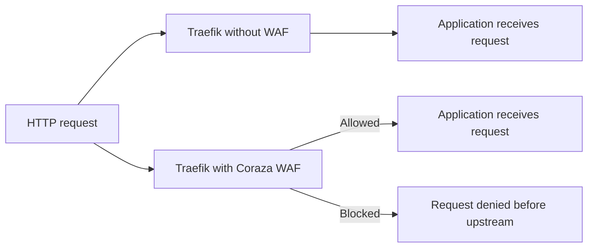

# Part 7: Optional Coraza WAF Add-On

## 1. Overview

This part is an optional add-on.

It introduces a web application firewall so that request behaviour can be compared with WAF off and on.

For this lab, the most reliable Traefik-native Coraza option is the native Coraza WAF in Traefik Hub API Gateway.

That means this add-on is presented separately from the core Traefik Proxy path used in Labs 2 and 4.

If the native Traefik Hub API Gateway WAF is not available in the environment, skip this part rather than forcing it into the core lab path.

## 2. Why This Part Is Optional

The core learning goals of Lab 4 do not depend on WAF.

The main lab already covers:

* log-based analysis with CrowdSec
* image assessment with Trivy
* application testing with ZAP

The WAF add-on is included because it provides a useful comparison:

* what happens when a suspicious request reaches the application normally
* what happens when a WAF evaluates the same request before it reaches the application

## 3. Suggested Protected Target

Use one route only for the WAF comparison.

Suggested target:

* Juice Shop through its existing path

This keeps the scope small and makes the comparison easier to observe.

## 4. Conceptual Request Flow with WAF

Without WAF:

1. browser -> Traefik -> application

With WAF:

1. browser -> Traefik with Coraza WAF middleware
2. WAF evaluates the request
3. if allowed, Traefik forwards the request to the application
4. if denied, the request is blocked before it reaches the application

## 5. Diagram: WAF Off vs WAF On

## 6. Learning Goal for the WAF Comparison

The point of this add-on is not to claim that a WAF solves application security by itself.

The point is to show that a WAF can sometimes act as an in-line protective layer that inspects requests and blocks patterns before they reach the upstream application.

This is often described as a form of virtual patching or compensating control.

## 7. Test Design

A good test sequence is:

1. choose a suspicious request pattern against a vulnerable application route
2. observe behaviour with WAF off
3. enable the WAF for that route
4. repeat the request
5. compare browser behaviour, application response, and logs

The exact rule set and request pattern will depend on the WAF environment available to you.

## 8. Browser and Log Observation

Use both browser developer tools and logs while comparing WAF off and on.

Observe:

* HTTP status code differences
* whether the upstream application receives the request
* whether the response body differs
* what appears in Traefik logs
* whether the application logs show the request when WAF is on

## 9. Important WAF Caveats

A WAF can help, but it also has limits.

Important points to emphasise:

* a WAF does not replace fixing the underlying application issue
* a WAF may block some malicious patterns but miss others
* a WAF may generate false positives and block legitimate requests
* rules must be tuned and reviewed

## 10. Exercises

1. Explain the difference between a log-based security control such as CrowdSec and an in-line control such as a WAF.
2. Choose one request pattern and describe how you would compare WAF off and WAF on.
3. Explain why the WAF is treated as an optional add-on rather than a required base component of the whole lab.

## 11. Documentation and Further Reading

* Traefik WAF middleware reference: https://doc.traefik.io/traefik/reference/routing-configuration/http/middlewares/waf/
* Coraza project documentation: https://www.coraza.io/docs/
