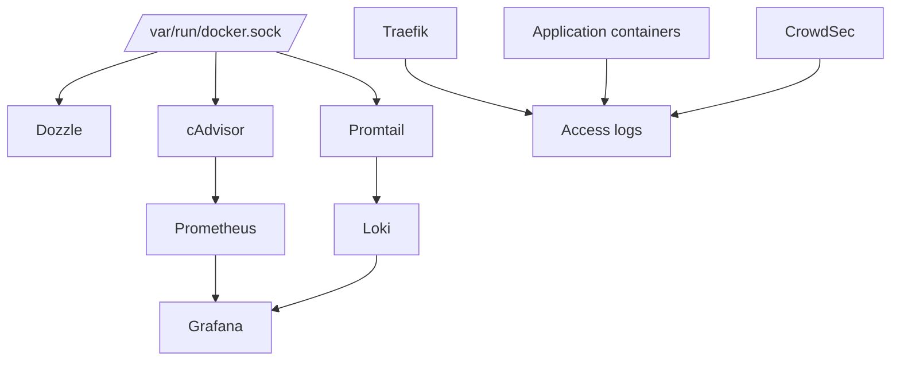

# Part 1: Lab 5 Overview and Architecture

## 1. Purpose of Lab 5

Lab 5 introduces a practical observability stack and uses it to reinforce the ideas from the Week 5 lecture on logging, monitoring, observability, and DevSecOps.

The main questions in this lab are:

* how can logs from multiple containers be viewed and correlated more easily?
* how can logs be retained and queried over time rather than only viewed live?
* how can useful metrics be collected from the host and containers?
* how can those metrics be stored, queried, and visualised?
* how can logs and metrics be used together to understand failure, misuse, or attack behaviour?

This lab keeps the earlier container environment and builds an observability layer around it rather than replacing it.

## 2. Why This Lab Builds on Lab 4

Lab 4 introduced active defense, vulnerability scanning, and security testing.

Those activities generated useful evidence:

* application logs
* reverse-proxy logs
* container runtime behaviour
* suspicious traffic patterns
* CrowdSec alerts and decisions

Lab 5 uses those existing services and signals so that the observability tooling has realistic data to work with.

## 3. Main Learning Goals

By the end of this lab, the environment should demonstrate:

* how to restore the working Lab 4 base
* how to use Dozzle for real-time log viewing across containers
* how Promtail forwards logs into Loki
* how Loki stores and exposes retained logs for querying
* how cAdvisor exposes container and host metrics
* how Prometheus scrapes and stores time-series metrics
* how Grafana connects to both Prometheus and Loki
* how logs and metrics can be interpreted together during troubleshooting and security investigations

## 4. Logging, Monitoring, and Observability in This Lab

This lab deliberately uses more than one type of telemetry because the differences matter.

* **Logging** records events. In this lab, Dozzle makes live logs easy to inspect, and Loki makes logs queryable over time.
* **Monitoring** tracks measurable conditions over time. In this lab, Prometheus and Grafana are used for that purpose.
* **Observability** combines multiple signals and context. In this lab, that means using live logs, retained logs, metrics, dashboards, and investigation workflow together.

## 5. Why Both Dozzle and Loki Are Included

At first glance, Dozzle and Loki both seem to deal with logs, but they solve different problems.

### Dozzle is useful for:

* quickly checking what a container is doing right now
* viewing live stdout and stderr streams
* fast troubleshooting during startup or testing

### Loki is useful for:

* retaining logs beyond the immediate live view
* querying logs by labels and time range
* correlating events across multiple containers
* using Grafana as a shared place to inspect both metrics and logs

That means Dozzle provides the first easy entry point for logging, while Loki adds the retained and queryable log layer that Dozzle does not provide.

## 6. Runtime Services vs Observability Services

The existing application stack includes services such as:

* Traefik
* Dozzle
* Juice Shop
* WebGoat
* demo application containers
* PostgreSQL
* CrowdSec

Lab 5 adds or extends the observability side with:

* Dozzle for easier live log viewing
* Promtail for shipping logs to Loki
* Loki for retained log storage and querying
* cAdvisor as a metrics exporter
* Prometheus as a time-series database and query engine
* Grafana as the dashboard and visualisation layer

## 7. Final Architecture for Lab 5

The final stack in this lab looks like this:

1. containers produce logs and resource usage data
2. Dozzle reads Docker log streams for live log viewing
3. Promtail reads Docker and host log sources and forwards them to Loki
4. Loki stores logs and makes them queryable
5. cAdvisor reads container and host-level runtime information
6. Prometheus scrapes cAdvisor and stores the metrics
7. Grafana queries both Prometheus and Loki

## 8. Diagram: Observability Stack Overview

## 9. What This Lab Is Not

This lab does not attempt to build a full enterprise observability platform with every possible feature.

It does not attempt distributed tracing across all services, and it does not cover large-scale clustered logging architectures.

Instead, it focuses on a clear, practical path that supports beginner-friendly understanding:

* live logs first
* retained logs next
* metrics next
* storage and querying next
* dashboards and investigation workflow after that

## 10. Practical Use Cases in This Lab

The stack built here can be used to answer questions such as:

* which container is restarting repeatedly?
* when did CPU usage spike and which service was involved?
* did request errors increase at the same time as memory pressure?
* what was CrowdSec doing during suspicious traffic?
* what changed before the service became slow?
* which services logged related events in the same time window?

## 11. Why Logs and Metrics Must Be Used Together

Metrics are very good at showing trends and thresholds.
Logs are very good at showing detailed events.

For example:

* Prometheus might show a spike in response latency
* Loki might show a cluster of application exceptions during the same period
* Dozzle might help confirm the live behaviour while testing a fix

Used together, they explain more than either signal alone.

## 12. Relationship to DevSecOps

This lab also supports DevSecOps ideas from the lecture.

A secure delivery process is not complete when deployment finishes.
The running system must still be visible and measurable.

Observability supports:

* post-deployment validation
* faster troubleshooting
* security investigations
* incident response preparation
* better feedback into later design and engineering decisions

## 13. Exercises

1. Explain the difference between live log viewing and retained log querying using examples from the lab.
2. Identify which part of the architecture stores metrics and which part stores logs.
3. Explain why the lab uses both Dozzle and Loki rather than only one logging tool.
4. Explain how this lab reinforces the observability ideas introduced in the Week 5 lecture.
