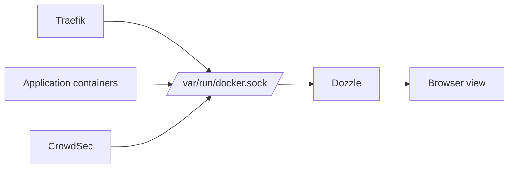

# Part 3: Logging with Dozzle

## 1. Overview

This part focuses on logging as the first observability signal.

The main idea is simple: if the environment is producing logs, there must be a practical way to inspect them quickly without manually running `docker logs` for every container.

Dozzle provides that live log-viewing layer.

## 2. Why Live Log Viewing Matters

Container environments often contain many services.

Running `docker logs` repeatedly across all of them is slow and awkward, especially when investigating:

* startup failures
* repeated restarts
* suspicious requests
* application exceptions
* connectivity problems

A single place to view live logs makes troubleshooting much easier.

## 3. What Dozzle Does

Dozzle is a lightweight web-based log viewer for Docker environments.

It reads the Docker socket and presents container logs in a browser interface.

This means it can show logs from many running containers without each one needing a special logging configuration.

## 4. What Dozzle Does Not Do

Dozzle is not a full log storage and search platform.

It is useful for:

* real-time viewing
* quick filtering
* browsing recent output

It is not intended to replace full retained log pipelines such as Loki or Elasticsearch-based systems.

## 5. Diagram: Dozzle in the Lab Environment



## 6. Check Whether Dozzle Already Exists

Because earlier labs already used Dozzle, first check whether the service is already running:

```bash
docker compose ps
docker compose logs dozzle --tail=50
```

If Dozzle already exists and is working, you can keep it and continue to the validation steps below.

If it is missing, add it as described in the next section.

## 7. Add or Review the Dozzle Service in `docker-compose.yml`

Use a Dozzle service similar to this:

```yaml
  dozzle:
    image: amir20/dozzle:latest
    container_name: dozzle
    restart: unless-stopped
    command:
      - '--base=/dozzle'
    volumes:
      - '/var/run/docker.sock:/var/run/docker.sock:ro'
    networks:
      - frontend_net
    labels:
      - 'traefik.enable=true'
      - 'traefik.docker.network=frontend_net'
      - 'traefik.http.routers.dozzle.rule=PathPrefix(`/dozzle`)'
      - 'traefik.http.routers.dozzle.entrypoints=websecure'
      - 'traefik.http.routers.dozzle.tls=true'
      - 'traefik.http.services.dozzle.loadbalancer.server.port=8080'
```

## 8. Explain the Key Dozzle Settings

### `--base=/dozzle`

This tells Dozzle that it is being served under the `/dozzle` path behind Traefik, rather than from the root of a site.

### Docker socket mount

```yaml
      - '/var/run/docker.sock:/var/run/docker.sock:ro'
```

This gives Dozzle read-only access to Docker metadata and log streams.

Without that mount, Dozzle would not be able to see the container logs.

### Traefik labels

These publish Dozzle securely through the existing reverse proxy path:

* router rule: `/dozzle`
* entrypoint: `websecure`
* TLS: enabled
* service port: internal port `8080`

## 9. Start or Recreate Dozzle

```bash
docker compose up -d dozzle
```

If you changed the configuration and need to recreate it:

```bash
docker compose up -d --force-recreate dozzle
```

## 10. Open Dozzle in the Browser

From the host system, open:

```text
https://localhost:8443/dozzle/
```

If the route is working, the Dozzle interface should appear and show available containers.

## 11. First Log Review Workflow

A useful first workflow is:

1. open Dozzle
2. choose the `traefik` container and inspect access and routing messages
3. choose `app-nginx` or `app-php` and inspect application-side messages
4. choose `crowdsec` and inspect security-related processing messages

This quickly shows how logs differ by service role.

## 12. Comparing Logs from Different Services

Different services produce very different kinds of logs.

Examples:

* Traefik logs show routing, HTTP handling, and reverse-proxy behaviour
* app logs show application behaviour and errors
* CrowdSec logs show parsing, alerts, and decisions
* database logs show startup, connections, and query-related events

Observability improves when these are read together rather than in isolation.

## 13. Example Investigation: Failed Route

Suppose the `/app` route begins returning errors.

A useful Dozzle-based investigation sequence would be:

1. inspect `traefik` logs to confirm the route is being hit
2. inspect `app-nginx` logs to see whether requests are reaching the web server
3. inspect `app-php` logs to see whether application-side failures are occurring

This helps distinguish:

* routing failure
* reverse-proxy failure
* application failure

## 14. Example Investigation: Suspicious Traffic

Suppose repeated suspicious requests are sent to WebGoat or Juice Shop.

A useful workflow would be:

1. watch `traefik` logs for unusual paths or request patterns
2. inspect `crowdsec` logs for detection-related messages
3. inspect the application logs to see whether the requests reached the service and how it responded

## 15. Limitations of Dozzle

Dozzle is useful, but it has important limits:

* it is primarily a live view rather than a full retained log system
* it is not designed as a long-term forensic archive
* it depends on the logs still being available through Docker

This is why Dozzle is a good first observability tool, but not the whole observability solution.

## 16. Exercises

1. Open Dozzle and inspect logs from at least four different containers.
2. Compare the log style and content of Traefik, CrowdSec, and one application container.
3. Trigger a request to `/app` and identify where that request appears in the available logs.
4. Explain why Dozzle is useful for troubleshooting but not a full retained log platform.
