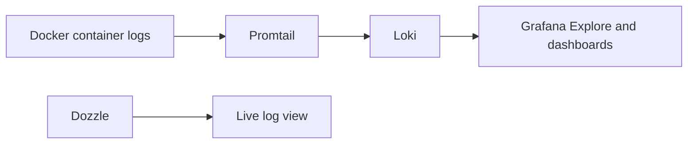

# Part 4: Retained Logs with Loki and Promtail

## 1. Overview

This part extends the logging layer beyond live viewing.

Dozzle is useful for what is happening right now, but it is weaker when the goal is to search and correlate logs over a wider time range.

Loki and Promtail add that retained log capability.

## 2. What Loki Does

Loki is a log aggregation and query system that works well with Grafana.

It stores logs and allows them to be queried later using labels and time ranges.

Loki is particularly useful when the goal is to answer questions such as:

* what did Traefik log over the last hour?
* show all CrowdSec log lines containing `decision`
* which services logged `error` during the same failure window?

## 3. What Promtail Does

Promtail is the log shipping component.

It reads logs from configured sources, adds labels, and forwards the log entries to Loki.

In this lab, Promtail is used to read Docker container logs so that Loki can store them.

## 4. Loki vs Dozzle

These tools solve different logging problems.

### Dozzle

* live log viewing
* quick troubleshooting
* direct container-level inspection

### Loki

* retained logs
* time-range queries
* label-based filtering
* log exploration inside Grafana

Using both gives a more complete observability workflow than either tool alone.

## 5. Diagram: Loki Logging Pipeline



## 6. Create the Loki Configuration File

Create `monitoring/loki/loki-config.yml` with this content:

```yaml
auth_enabled: false

server:
  http_listen_port: 3100

common:
  path_prefix: /loki
  storage:
    filesystem:
      chunks_directory: /loki/chunks
      rules_directory: /loki/rules
  replication_factor: 1
  ring:
    instance_addr: 127.0.0.1
    kvstore:
      store: inmemory

schema_config:
  configs:
    - from: 2024-01-01
      store: tsdb
      object_store: filesystem
      schema: v13
      index:
        prefix: index_
        period: 24h

ruler:
  alertmanager_url: http://localhost:9093

analytics:
  reporting_enabled: false
```

## 7. Explain the Loki Configuration

This is a simple single-node Loki configuration suitable for a lab.

Important points:

* `auth_enabled: false` keeps the lab setup simple
* `http_listen_port: 3100` is the default Loki HTTP port
* filesystem storage is used for local retention
* replication factor is `1` because this is not a clustered design

This is intentionally simpler than a production-grade distributed Loki deployment.

## 8. Add the Loki Service to `docker-compose.yml`

Use a service definition like this:

```yaml
  loki:
    image: grafana/loki:latest
    container_name: loki
    restart: unless-stopped
    command: -config.file=/etc/loki/local-config.yaml
    volumes:
      - './monitoring/loki/loki-config.yml:/etc/loki/local-config.yaml:ro'
      - 'loki_data:/loki'
    networks:
      - backend_net
```

Then add the volume definition at the bottom of the Compose file:

```yaml
volumes:
  pgdata:
  traefik_logs:
  crowdsec_db:
  crowdsec_config:
  prometheus_data:
  grafana_data:
  loki_data:
```

## 9. Create the Promtail Configuration File

Create `monitoring/promtail/promtail-config.yml` with this content:

```yaml
server:
  http_listen_port: 9080
  grpc_listen_port: 0

positions:
  filename: /tmp/positions.yaml

clients:
  - url: http://loki:3100/loki/api/v1/push

scrape_configs:
  - job_name: docker
    static_configs:
      - targets:
          - localhost
        labels:
          job: docker
          __path__: /var/lib/docker/containers/*/*-json.log
```

## 10. Explain the Promtail Configuration

### `clients`

This tells Promtail where to send logs.

In this lab, the destination is the internal Loki service on port `3100`.

### `positions`

This allows Promtail to remember how far it has read in the log files so that it can continue sensibly after restarts.

### `__path__`

This points Promtail at Docker container JSON log files on the host.

That is how Promtail can read logs from many containers without each one needing a separate shipper.

## 11. Add the Promtail Service to `docker-compose.yml`

Use a service definition like this:

```yaml
  promtail:
    image: grafana/promtail:latest
    container_name: promtail
    restart: unless-stopped
    command: -config.file=/etc/promtail/config.yml
    volumes:
      - './monitoring/promtail/promtail-config.yml:/etc/promtail/config.yml:ro'
      - '/var/lib/docker/containers:/var/lib/docker/containers:ro'
      - '/var/log:/var/log:ro'
    networks:
      - backend_net
```

## 12. Start Loki and Promtail

```bash
docker compose up -d loki promtail
```

Then inspect the containers:

```bash
docker compose ps
docker compose logs loki --tail=100
docker compose logs promtail --tail=100
```

## 13. Why Promtail Reads Docker Log Files Instead of the Docker Socket

There are several ways to collect logs in container environments.

In this lab, reading Docker container log files is a simple and direct approach.

It avoids introducing more moving parts while still providing a realistic retained log pipeline.

## 14. How Loki Will Be Verified

The easiest verification path is through Grafana after Grafana is configured with Loki as a data source.

At that point, logs can be explored using label-based and content-based queries.

This is more useful than only checking the Loki service in isolation because it confirms the actual operator workflow.

## 15. Example Log Questions for Loki

Once Grafana is connected to Loki, useful questions will include:

* show logs from Traefik over the last 15 minutes
* show logs containing `error`
* show CrowdSec logs containing `decision`
* compare logs from multiple services during the same failure window

These examples are intentionally simple and are based on logs already available in the lab.

## 16. Exercises

1. Create the Loki and Promtail configuration files and explain the main fields.
2. Start Loki and Promtail and confirm that both services are running.
3. Explain the difference between a log shipper and a log store.
4. Explain why retained logs are useful even when Dozzle is already available for live viewing.
