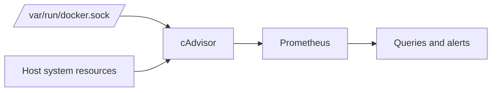

# Part 5: Metrics with cAdvisor and Prometheus

## 1. Overview

This part introduces the monitoring side of the observability stack.

Logs show detailed events, but they do not always show broader system behaviour over time.

Metrics solve a different problem:

* how busy is the system?
* how much memory is being used?
* how often are errors happening?
* is performance getting better or worse?

In this lab, cAdvisor exposes runtime metrics and Prometheus stores them.

## 2. What cAdvisor Does

cAdvisor stands for Container Advisor.

It collects runtime information about containers and the host environment and exposes that information as metrics over HTTP.

These metrics can then be scraped by Prometheus.

## 3. What Prometheus Does

Prometheus is a pull-based metrics and alerting system.

It:

* scrapes targets over HTTP at intervals
* stores the results as time-series data
* supports queries over that data
* can evaluate alert rules

This means Prometheus does not only view the current state. It also preserves metric history for later analysis.

## 4. Diagram: Metrics Pipeline



## 5. Why Metrics Need a Storage Layer

cAdvisor can expose current metric values, but it is not designed to be the main historical database for the environment.

Without Prometheus, you could see current values but not easily answer questions such as:

* what happened 30 minutes ago?
* when did CPU usage start climbing?
* was memory usage increasing before the container restarted?

Prometheus is the historical storage and query layer for those questions.

## 6. Add the cAdvisor Service to `docker-compose.yml`

Use a service definition like this:

```yaml
  cadvisor:
    image: gcr.io/cadvisor/cadvisor:v0.49.1
    container_name: cadvisor
    restart: unless-stopped
    privileged: true
    devices:
      - /dev/kmsg
    volumes:
      - '/:/rootfs:ro'
      - '/var/run:/var/run:ro'
      - '/sys:/sys:ro'
      - '/var/lib/docker/:/var/lib/docker:ro'
      - '/dev/disk/:/dev/disk:ro'
    networks:
      - backend_net
```

## 7. Explain the cAdvisor Mounts

These mounts are important because cAdvisor needs access to host and container runtime information.

### `/:/rootfs:ro`

This gives read-only access to the host root filesystem view needed for inspection.

### `/var/run:/var/run:ro`

This helps cAdvisor inspect runtime information provided through system runtime paths.

### `/sys:/sys:ro`

This provides access to kernel and cgroup-related information used for metrics.

### `/var/lib/docker/:/var/lib/docker:ro`

This allows cAdvisor to inspect Docker container state information.

### `/dev/disk/:/dev/disk:ro`

This helps with disk-related visibility.

## 8. Why cAdvisor Is Placed on `backend_net`

cAdvisor is an internal metrics service and does not need direct public exposure.

Placing it on `backend_net` keeps it reachable to internal observability components such as Prometheus without publishing it unnecessarily to the outside.

## 9. Start cAdvisor

```bash
docker compose up -d cadvisor
```

Then confirm that it is running:

```bash
docker compose ps
docker compose logs cadvisor --tail=100
```

## 10. Verify the cAdvisor Metrics Endpoint

Because cAdvisor is on the internal network, the easiest way to inspect it is from another container on the same network or by temporarily using `docker compose exec` from an existing service shell where appropriate.

A quick method is to check the service from the host by using Docker networking tools or to inspect from Prometheus after Prometheus has been added.

For example, after Prometheus is running, the Prometheus target page becomes the easiest validation point.

## 11. Create the Prometheus Configuration File

Create `monitoring/prometheus/prometheus.yml` with this content:

```yaml
global:
  scrape_interval: 15s

scrape_configs:
  - job_name: 'cadvisor'
    static_configs:
      - targets: ['cadvisor:8080']
```

## 12. Explain the Prometheus Configuration

### `scrape_interval: 15s`

This tells Prometheus how often to collect metric data from targets by default.

A shorter interval gives more detailed history but increases storage and scrape load.

### `job_name: 'cadvisor'`

This is the label Prometheus uses for the target group.

It helps identify which target the metrics came from.

### `targets: ['cadvisor:8080']`

This uses Docker-internal service discovery through the Compose network.

Prometheus will contact the `cadvisor` service on port `8080` over the internal Docker network.

## 13. Add the Prometheus Service to `docker-compose.yml`

Use a service definition like this:

```yaml
  prometheus:
    image: prom/prometheus:latest
    container_name: prometheus
    restart: unless-stopped
    volumes:
      - './monitoring/prometheus/prometheus.yml:/etc/prometheus/prometheus.yml:ro'
      - 'prometheus_data:/prometheus'
    networks:
      - backend_net
```

Then add the named volume at the bottom of the Compose file:

```yaml
volumes:
  pgdata:
  traefik_logs:
  crowdsec_db:
  crowdsec_config:
  prometheus_data:
  grafana_data:
  loki_data:
```

If your current volume block already contains more entries, keep them and add `prometheus_data` alongside them.

## 14. Start Prometheus

```bash
docker compose up -d prometheus
```

Then inspect the container:

```bash
docker compose ps
docker compose logs prometheus --tail=100
```

## 15. Expose Prometheus Temporarily for Validation

Prometheus can remain internal in a hardened deployment, but during setup it is useful to publish it temporarily for validation.

Add this to the Prometheus service if desired during setup:

```yaml
    ports:
      - '9090:9090'
```

Then recreate the service:

```bash
docker compose up -d --force-recreate prometheus
```

Now open in the browser:

```text
http://localhost:9090
```

## 16. Check the Targets Page

In Prometheus, open the **Status -> Targets** page.

The `cadvisor` target should appear and should be marked **UP**.

This is one of the most important first checks because it confirms that the metrics pipeline is actually working.

## 17. Run a First Prometheus Query

A useful first query is:

```text
container_cpu_usage_seconds_total
```

Another useful query is:

```text
container_memory_usage_bytes
```

These results may contain many series because they represent multiple containers.

That is normal and is part of how Prometheus models metric data.

## 18. Example Investigation Using Prometheus

Suppose the environment feels slow.

Useful Prometheus questions include:

* did CPU usage rise sharply?
* did one container begin consuming far more memory than usual?
* did a container disappear or restart during the period of interest?

Metrics do not explain every detail, but they reveal trends and changes very quickly.

## 19. Exercises

1. Add cAdvisor and confirm that it starts correctly.
2. Create the Prometheus configuration file and explain each field.
3. Add Prometheus and verify that the `cadvisor` target is marked UP.
4. Run at least two Prometheus queries and explain what the results represent.
5. Explain why cAdvisor alone is not enough without a metrics storage layer such as Prometheus.
