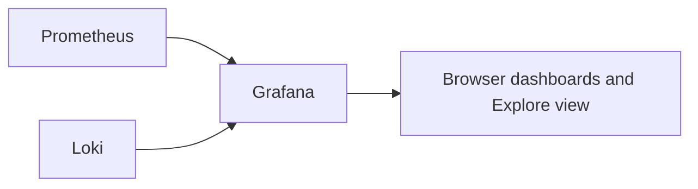

# Part 6: Visualisation and Alerting with Grafana

## 1. Overview

This part adds Grafana as the visualisation layer for both metrics and retained logs.

Prometheus is very good at collecting and querying metrics.
Loki is very good at storing and querying logs.
Grafana provides a shared place to explore both.

## 2. Why Grafana Matters

Raw metrics and raw logs are useful, but they are not always easy to interpret quickly.

Grafana helps answer questions such as:

* which container is using the most CPU right now?
* did memory usage rise gradually or suddenly?
* what did Traefik and the application log during the same failure window?
* did multiple services become slow at the same time?

## 3. Diagram: Grafana with Prometheus and Loki



## 4. Add the Grafana Service to `docker-compose.yml`

Use a service definition like this for the initial setup phase:

```yaml
  grafana:
    image: grafana/grafana:latest
    container_name: grafana
    restart: unless-stopped
    environment:
      GF_SECURITY_ADMIN_USER: admin
      GF_SECURITY_ADMIN_PASSWORD: adminsecure
    ports:
      - '3000:3000'
    volumes:
      - 'grafana_data:/var/lib/grafana'
    networks:
      - frontend_net
      - backend_net
```

Then add the volume definition at the bottom of the Compose file:

```yaml
volumes:
  pgdata:
  traefik_logs:
  crowdsec_db:
  crowdsec_config:
  prometheus_data:
  grafana_data:
  loki_data:
```

## 5. Explain the Grafana Settings

### Admin credentials

```yaml
      GF_SECURITY_ADMIN_USER: admin
      GF_SECURITY_ADMIN_PASSWORD: adminsecure
```

These are only for the initial lab setup and should be changed in any more serious environment.

### Published port `3000:3000`

This makes Grafana reachable directly on `http://localhost:3000` during setup.

This is convenient for initial validation, but later in the lab a more controlled access model is discussed.

### Networks

Grafana is attached to both:

* `frontend_net` so it can be reached from the current environment design
* `backend_net` so it can talk internally to Prometheus and Loki

## 6. Start Grafana

```bash
docker compose up -d grafana
```

Then confirm it is running:

```bash
docker compose ps
docker compose logs grafana --tail=100
```

## 7. Open Grafana in the Browser

From the host system, open:

```text
http://localhost:3000
```

Log in with:

* username: `admin`
* password: `adminsecure`

Grafana may ask for a password change on first login depending on version and configuration.

## 8. Add Prometheus as a Data Source

Inside Grafana:

1. open **Connections** or **Data sources** depending on the version
2. choose **Add data source**
3. select **Prometheus**
4. enter this URL:

```text
http://prometheus:9090
```

5. save and test the data source

## 9. Add Loki as a Data Source

Now add Loki as a second data source.

Use this URL:

```text
http://loki:3100
```

Then save and test the data source.

## 10. Why Internal Service Names Are Used

Grafana talks to Prometheus and Loki over the internal Docker network, not through host browser paths.

That is why the correct internal URLs are:

* `http://prometheus:9090`
* `http://loki:3100`

These use the Compose service names as internal hostnames.

## 11. Build a First Metrics Dashboard Manually

Creating at least one manual dashboard is important because it shows how Grafana actually works before imported dashboards are used.

A useful first panel is CPU usage.

Create a new dashboard and add a panel using a Prometheus query such as:

```text
rate(container_cpu_usage_seconds_total[1m])
```

Then create another panel using:

```text
container_memory_usage_bytes
```

## 12. Explain the Example Queries

### `rate(container_cpu_usage_seconds_total[1m])`

This approximates recent CPU usage rate over the last minute.

The `rate(...)` function is useful for cumulative counter-style metrics where the change over time matters more than the raw counter value.

### `container_memory_usage_bytes`

This shows current memory usage values.

This is easier to interpret directly because it is already a current-state metric rather than a counter.

## 13. Use Grafana Explore with Loki

Grafana's **Explore** view is the easiest first place to use Loki.

Choose the Loki data source and try simple log queries such as:

```text
{job="docker"}
```

Then refine the query by looking for text such as:

```text
{job="docker"} |= "error"
```

Or for CrowdSec activity:

```text
{job="docker"} |= "decision"
```

## 14. What These Loki Queries Do

### `{job="docker"}`

This selects log streams with the `job` label set to `docker`.

In this lab, Promtail adds that label to the Docker log source.

### `|= "error"`

This filters the selected logs to lines containing the string `error`.

### `|= "decision"`

This filters the selected logs to lines containing the string `decision`.

That is useful for quickly locating some CrowdSec-related messages.

## 15. Build a Simple Log Panel

Grafana can also display log-based panels.

A useful first example is to add a panel that shows recent logs matching a query such as:

```text
{job="docker"} |= "error"
```

This is a good way to connect the idea of dashboards with retained logs.

## 16. Import a Community Dashboard

After creating a small manual dashboard, a community dashboard can be imported to accelerate the setup.

A common example is a cAdvisor or Docker monitoring dashboard.

Import workflow:

1. open **Dashboards**
2. choose **Import**
3. enter a known dashboard ID
4. choose the Prometheus data source
5. load the dashboard

## 17. Why Manual Dashboard Creation Still Matters

Imported dashboards are convenient, but they can also hide how the data really works.

That is why this lab uses both:

* manual dashboard creation for understanding
* imported dashboards for speed and breadth

## 18. Using Grafana to Establish a Baseline

An important goal is not just to see the current value of a metric but to understand what normal looks like.

Examples:

* what CPU range is normal for Juice Shop during ordinary browsing?
* what memory usage is typical for WebGoat after startup?
* how stable is the reverse proxy under low load?
* what kinds of log messages normally appear during routine use?

Without a baseline, it is difficult to know whether later changes are important.

## 19. Simple Alerting Discussion

Grafana and Prometheus can both be involved in alerting workflows depending on configuration and architecture.

At a conceptual level, useful alerts might include:

* container memory usage remains unusually high for several minutes
* request error rates increase sharply
* a critical service disappears from scraping targets
* unusual log patterns appear repeatedly during a short window

The main point here is that alerts should be meaningful and actionable, not just numerous.

## 20. Example Investigation with Grafana

Suppose the application feels slow or unstable.

A Grafana investigation might look like this:

1. open the dashboard for container metrics
2. inspect CPU and memory behaviour around the time of the issue
3. open Explore and inspect Loki logs during the same time range
4. check whether more than one service changed at once
5. compare that with live logs in Dozzle if testing is still in progress

This is where monitoring starts to become observability.

## 21. Exercises

1. Add Grafana and confirm that it starts correctly.
2. Add both Prometheus and Loki as data sources and explain why the internal service names are used.
3. Build at least two manual metrics panels using Prometheus queries.
4. Run at least two simple Loki queries in Grafana Explore and explain what they return.
5. Import one community dashboard and compare it with your manual dashboard.
6. Identify what appears to be the normal CPU, memory, and log baseline for at least two containers.
