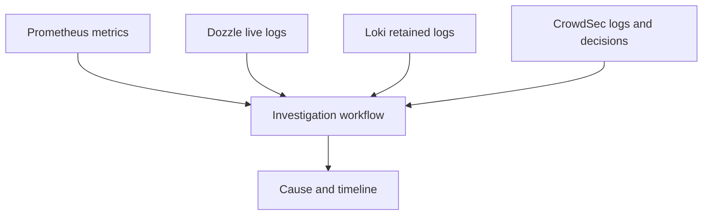

# Part 7: Using Logs and Metrics Together

## 1. Overview

This part turns the stack from a collection of tools into an investigation workflow.

The main idea is that logs and metrics are strongest when they are used together.

* Metrics reveal trends, load, and threshold breaches.
* Logs reveal detailed events and local context.

Using them together makes it easier to explain what happened and why.

## 2. Why This Is Observability Rather Than Only Monitoring

Monitoring alone might show that CPU usage increased or that response time got worse.

Observability begins when those metric changes are correlated with additional evidence such as:

* reverse-proxy logs
* application errors
* container restarts
* CrowdSec activity

## 3. Diagram: Correlating Logs and Metrics

## 4. Example Scenario 1: Slow Application Response

Suppose `/app` becomes noticeably slow.

A useful workflow is:

1. inspect Grafana for CPU and memory changes
2. inspect Prometheus targets and container health indicators
3. inspect Loki logs for `app-nginx`, `app-php`, and `traefik` in the same period
4. use Dozzle if the issue is still happening live
5. determine whether the slowness is due to routing, application behaviour, or backend pressure

## 5. Example Scenario 2: Sudden Error Rate Increase

Suppose browsers begin receiving more errors.

A useful sequence is:

1. use Grafana to see whether load or memory changed first
2. use Loki to search for `error` across relevant services
3. use Dozzle to inspect the current live output if testing is still in progress
4. determine whether the application began failing before or after the resource change

This helps separate symptom from cause.

## 6. Example Scenario 3: Suspicious Traffic and CrowdSec

Suppose repeated suspicious requests are sent to WebGoat or Juice Shop.

A useful workflow is:

1. inspect Traefik-related logs for the request pattern
2. inspect CrowdSec logs for alerts or decisions
3. inspect Grafana for any related resource spikes
4. compare the timing across logs and metrics

This is particularly useful because it links earlier security work from Lab 4 to the observability layer in Lab 5.

## 7. Example Scenario 4: Container Restart Investigation

Suppose a container restarts unexpectedly.

A useful workflow is:

1. use Grafana to inspect resource usage before the restart
2. use Loki to inspect the earlier retained log output before the restart
3. use Dozzle to inspect any current repeating behaviour if the problem continues
4. identify whether the cause appears to be:

* memory pressure
* application crash
* configuration problem
* external dependency failure

## 8. Establishing Baselines

A recurring theme in observability is the idea of a baseline.

A baseline means knowing what normal looks like for the environment.

Examples include:

* normal CPU usage during light browsing
* expected memory usage after startup settles
* normal request rate at idle and under deliberate testing
* normal log volume and message patterns for each service

Without that baseline, it is much harder to recognise meaningful anomalies.

## 9. Practical Baseline Exercise

A useful exercise is to compare at least two different states:

* idle or light-use state
* active browsing or testing state

Then record:

* which containers change most
* how quickly metrics return to baseline
* whether any service behaves unpredictably under normal activity
* whether the log pattern changes significantly

## 10. Dozzle vs Loki vs Grafana in Investigation

These tools answer different kinds of questions.

### Dozzle is stronger for:

* current detailed events
* startup and error logs
* quick per-container inspection

### Loki is stronger for:

* querying older logs
* searching by time window
* comparing several services in the same window
* filtering logs by simple patterns

### Grafana is stronger for:

* trends over time
* comparing multiple services
* identifying baseline vs anomaly
* viewing logs and metrics from a shared interface

## 11. Example Investigation Workflow Summary

A practical workflow for many issues is:

1. start with Grafana to identify when the problem became visible
2. narrow the time range
3. inspect Loki logs in that same range
4. use Dozzle if the issue is still live and changing
5. compare application, reverse-proxy, and security-tool logs
6. form a timeline and explanation

## 12. Exercises

1. Investigate one performance-related scenario using both Grafana and logs.
2. Investigate one security-related scenario using Traefik logs, CrowdSec logs, and Grafana.
3. Record a baseline for at least two services and explain how you identified it.
4. Explain why observability is stronger than either logging-only or monitoring-only approaches.
